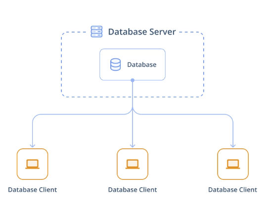

# Curso de SQL

Comandos básicos: 

SELECT [coluna(s)]

FROM [tabela]

Ex:

SELECT id, name, rating
FROM products;

Depois de rodar uma query do tipo SELECT, a visão que tenho é temporária e não está persistida para consultas futuras. O banco de dados original permanece inalterado. 

ORDER BY [coluna] ordena os registros da coluna por padrão no formato ascendente, sempre do menor para o maior:

SELECT id, name, rating
FROM products
ORDER BY rating;

DESC: altera o padrão do order by para ordenar no formato descendente, ou seja, do maior para menor. 

LIMIT X; limita a quantidade de registros que serão retornados com a query. 

SELECT id, name, rating
FROM products
ORDER BY rating DESC
LIMIT 10;

A query acima mostra apenas os 10 registros com maior rating.

Para eliminar registros duplicados, caso se queira apenas os registros únicos, deve-se usar DISTINCT, logo após o SELECT. 

exemplo: 

SELECT DISTINCT category
FROM products;

É possível renomear as colunas da visão para uma melhor explicação dos atributos selecionados dos dados originais. Por exemplo, usando a palavra “as”:

SELECT DISTINCT category AS unique_categories
FROM products;

O aliasing não altera o nome da coluna no banco de dados original, somente no recorte obtido. 

Exemplo 2: 

```sql
SELECT column_1 AS alias_name, column_2
FROM table_1;
```

A arquitetura básica de um banco de dados baseia-se no modelo de cliente-servidor. O servidor é o computador que abriga e roda o banco de dados e os clientes são estações de trabalho que se conectam de forma autônoma ao servidor, e assim conseguem fazer consultas e visualizar dados. 




O comando COUNT conta quantos registros com valores possui um determinado atributo.

Ex: 

SELECT COUNT(birthdate) AS count_birthdates

FROM people;

Reescrevendo a query de outra forma, podemos obter o total de registros de uma tabela

Ex: SELECT COUNT(*) AS total_records

FROM people;

É possível combinar COUNT e DISTINCT para contar quantos valores únicos existem em determinado atributo.

Ex: SELECT COUNT(DISTINCT birthdate) AS count_distinct_dirthdates

FROM people;

COUNT: inclui valores duplicados

DISTINCT: exclui valores duplicados.

A linguagem SQL, diferentemente de outras linguagens de programação, não é executada na ordem em que é escrita. 

Melhores práticas em codificação SQL:

1- Ponto e vírgula ao final da query

2- inserir snake_case nos nomes de colunas ou atributos que tenham mais de uma palavra

Caso exista em uma tabela um nome de coluna que não esteja no formato correto, por exemplo facebook likes, para elaborar a query deve-se colocar o nome entre aspas: “facebook likes”.

Filtragem: uso da palavra WHERE

WHERE pode ser usado com operadores de comparação > e <

Ex: 

SELECT title

FROM films

WHERE release_year <> 1960;

<>: significa exceto. Filtrará todos os ano, exceto 1960. 

SELECT title

FROM films

WHERE country = ´Japan’;

```sql
-- Count the records with at least 100,000 votes
SELECT COUNT(*) AS films_over_100k_votes
FROM reviews
WHERE num_votes >= 100000;
```

```sql
-- Count the Spanish-language films
SELECT COUNT(*) AS count_spanish
FROM films
WHERE language = 'Spanish';
```

Tratando-se de filtragem usando múltiplos critérios, tem-se palavras-chaves apropriadas para isso:

OR, AND, BETWEEN

Between: é inclusivo, ou seja, inclui os extremos. 

```sql
-- Select the title and release_year for all German-language films released before 2000
SELECT title, release_year
FROM films
WHERE (language = 'German') AND (release_year < 2000);  
```

```sql
-- Select all records for German-language films released after 2000 and before 2010
SELECT *
FROM films
WHERE (language = 'German') AND (release_year > 2000) AND (release_year < 2010); 
```

```sql
SELECT title, release_year
FROM films
WHERE (release_year = 1990 OR release_year = 1999)
	AND (language = 'English' OR language = 'Spanish')
	AND gross > 2000000;
```

```sql
SELECT title, release_year
FROM films
WHERE release_year BETWEEN 1990 AND 2000
	AND budget > 100000000
-- Amend the query to include Spanish or French-language films
	AND (language = 'Spanish' OR language = 'French');
```

Filtragem textual: LIKE, NOT LIKE, IN

LIKE: usado com % (representa 0, 1 ou muitos caracteres) ou _ (representa somente um caractere)

WHERE IN pode ser usado para organizar melhor a query e torná-la mais enxuta. Em vez de escrever WHERE year = ‘1990’ or year = ‘1991’ or year = ‘1992’, pode-se escrever WHERE year IN (1990, 1991, 1992)

```sql
-- Select the names that start with B
SELECT *
FROM people
WHERE name like 'B%';
```

```sql
SELECT name
FROM people
-- Select names that don't start with A
WHERE name NOT LIKE 'A%'
```

```sql
-- Find the title and language of all films in English, Spanish, and French
SELECT title, language
FROM films
WHERE language IN ('English', 'Spanish', 'French');
```

```sql
-- Find the title, certification, and language all films certified NC-17 or R that are in English, Italian, or Greek
SELECT title, certification, language
FROM films
WHERE certification IN ('NC-17', 'R') AND language IN ('English', 'Italian', 'Greek');
```

```sql
-- Count the unique titles
SELECT COUNT(DISTINCT title) AS nineties_english_films_for_teens
FROM films
-- Filter to release_years to between 1990 and 1999
WHERE release_year BETWEEN 1990 AND 1999
-- Filter to English-language films
	AND language = 'English'
-- Narrow it down to G, PG, and PG-13 certifications
	AND certification IN ('G', 'PG', 'PG-13');
```

Uso do IS NULL e IS NOT NULL

Ajudam a identificar, selecionar ou excluir missing values (NULL)

NULL: dados desconhecidos ou inexistentes

```sql
-- Count the number of films we have language data for
SELECT COUNT(*) AS count_language_known
FROM films
WHERE language IS NOT NULL
```

Summarizing data with AGGREGATE function


funções AGGREGATE fazem cálculos sobre vários valores e retornam um valor

São posicionadas logo após o SELECT.

 Média e soma só podem ser usadas em atributos numéricos. 

Contar, mínimo e máximo podem ser usadas em atributos não numéricos. (alfabeticamente, temporalmente…)

```sql
-- Find the latest release_year
SELECT MAX(release_year) AS latest_year
FROM films
```

```sql
-- Find the duration of the shortest film
SELECT MIN(duration) AS shortest_film
FROM films
```

Comando ROUND() arredonda valores respeitando o número de casas decimais que se quer. 

Exemplo: 

SELECT ROUND(AVG(budget), 2)

```sql
-- Calculate the sum of gross from the year 2000 or later
SELECT SUM(gross) AS total_gross
FROM films
WHERE release_year >= 2000
```

```sql
-- Calculate the lowest gross film in 1994
SELECT MIN(gross) AS lowest_gross
FROM films
WHERE release_year = 1994
```

```sql
-- Calculate the highest gross film released between 2000-2012
SELECT MAX(gross) AS highest_gross
FROM films
WHERE release_year BETWEEN 2000 AND 2012
```

```sql
-- Round the average number of facebook_likes to one decimal place
SELECT ROUND(AVG(facebook_likes), 1) AS avg_facebook_likes
FROM reviews
```


Diferença entre aggregate functions e aritimética: aggregate operam nas colunas, de forma vertical, já a aritimética opera nas linhas, na forma horizontal. 

Por exemplo, ao usar aggregate AVG em um atributo, ele retorna um só valor, que é o resultado da aplicação na coluna toda. 

Já no caso da aritimética, é usada para casos em que se tem uma coluna de receita bruta de um filme e outra coluna de despesa com o filme, e se quer informações sobre o lucro líquido. Nesse caso se faz SELECT (receita - despesa) AS lucro

```sql
-- Calculate the title and duration_hours from films
SELECT title, duration/60.0 AS duration_hours
FROM films;
```

```sql
-- Calculate the percentage of people who are no longer alive
SELECT COUNT(deathdate) * 100.0 / COUNT(*) AS percentage_dead
FROM people;
```

```sql
-- Find the number of decades in the films table
SELECT (MAX(release_year) - MIN(release_year)) / 10.0 AS number_of_decades
FROM films;
```

```sql
-- Round duration_hours to two decimal places
SELECT title, ROUND(duration / 60.0 , 2) AS duration_hours
FROM films;
```

Comando ORDER BY: ordena resultados de um ou mais campos.

Ele é executado depois do comando FROM. 

Por padrão, ordena de forma ascendente (ASC), ou seja, do menor para o maior. Para decrescente, é preciso explicitar DESC.

ORDER BY pode ser aplicado a mais de um atributo. O segundo atributo é usado como critério de desempate, no caso do primeiro não ser suficiente. 


O código acima será executado na seguinte ordem:

- FROM
- WHERE
- SELECT
- ORDER BY
- LIMIT

```sql
-- Select the title and duration from longest to shortest film
SELECT title, duration
FROM films
ORDER BY duration DESC
```

```sql
-- Select the title and duration from longest to shortest film
SELECT title, duration
FROM films
ORDER BY duration DESC
```

```sql
-- Select the release year, duration, and title sorted by release year and duration
SELECT release_year, duration, title
FROM films
ORDER BY release_year, duration
```

```sql
-- Select the certification, release year, and title sorted by certification and release year
SELECT certification, release_year, title
FROM films
ORDER BY certification ASC, release_year DESC
```

Agrupando dados

Para agrupar dados, é comum que se use GROUPBY juntamente de AGGREGATE functions.

A função AGGREGATE irá reduzir os atributos não agrupados a somente um registro, que irá corresponder a um grupo, ou seja, irá agrupar um atributo em um único registro e nomeá-lo. 

Necessariamente tenho que incluir no SELECT um atributo que está também no GROUPBY, senão irá retornar erro. 

É possível aplicar GROUP BY em múltiplos atributos, similarmente ao ORDER BY

É possível usar GROUP BY concomitantemente à ORDER BY, para agrupá-los, poder fazer cálculos, e em seguida ordenar os resultados. 

ORDER BY é sempre escrito após o GROUP BY: primeiro agrupa, depois ordena.

ORDEM DE EXECUÇÃO: 

1. FROM
2. GROUP BY * (execução logo após o FROM)
3. SELECT
4. ORDER BY
5. LIMIT

É como se eu abrisse o armário do FROM, e já agrupasse o que vou selecionar. 

Exemplo: Select the `release_year` and count of films released in each year aliased as `film_count`

Eu abro o armário do FROM, que é films e penso:  qual atributo eu quero agrupar? Eu quero transformar em registro?

Nesse caso, é `release_year` , então meu GROUP BY será para `release_year` .

Então penso novamente na ordem de execução: abro o armário do FROM (films), e agrupando por `release_year` , selecionarei COUNT(`release_year` ) para obter o número de filmes em cada ano.

E como quero mostrar também uma coluna com cada ano de lançamento, também entra no select o release_year, sem o count, para listar os anos. 

Então o comando fica: 

```sql
-- Find the release_year and film_count of each year
SELECT release_year, COUNT(*) AS film_count
FROM films
GROUP BY release_year
```

Pensar em escrever a cláusula a partir da ordem de execução, pode ser melhor para pensar. 

Agora nesse próximo exemplo, a questão é:

• Select the `release_year` and average duration aliased as `avg_duration` of all films, grouped by `release_year`.

Nesse caso, pense no resultado que se quer: uma tabela com duas colunas, uma com ano e outra com duração média dos filmes daquele ano. 

Então vou abrir o armário do FROM (films), e em seguida vou agrupar.

Vou agrupar por `release_year` , que é o atributo que quero transformar em registros. 

Em seguida, a função aggregate irá fazer os cálculos de dados não ainda reunidos, e atribuí-los às linhas criadas pelo group by.

Então eu pensaria assim:

FROM films

GROUP BY `release_year` 

em seguida, criaria a SELECT assim:

SELECT `release_year`, AVG(`duration`) AS avg_duration

e voilà:

```sql
-- Find the release_year and average duration of films for each year
SELECT release_year, AVG(duration) AS avg_duration
FROM films
GROUP BY release_year
```

É exatamente esse o pensamento!

Agora o problema é esse:

• Select the `release_year`, `country`, and the maximum `budget` aliased as `max_budget` for each year and each country; sort your results by `release_year` and `country`.

Se quero os dados para CADA year e CADA country, eu terei que transformar esses atributos em linhas… ou seja, usar o GROUP BY.

primeiramente, abro o armário do FROM = films

Em seguida, penso nos agrupamentos: se quero o orçamento para cada ano e para cada país, por exemplo, Brasil 2024 e Brasil 2025, vou ter que agrupar por países e por anos. 

GROUP BY `release_year` , `country`

Depois tenho que pensar no select. O que irei selecionar? Necessariamente as cláusulas do GROUP BY (para não gerar erro): `country` e `release_year`  e também aplicarei a aggregate function MAX em `budget` e chamarei de  `max_budget` 

Portanto: 

SELECT `release_year`, `country`,MAX(`budget`) AS `max_budget`

Por último vem o SORT BY.

E a cláusula fica assim:

```sql
-- Find the release_year, country, and max_budget, then group and order by release_year and country
SELECT release_year, country, MAX(budget) AS max_budget
FROM films
GROUP BY release_year, country
ORDER BY release_year, country
```

Agora, uma pergunta de negócio: Using the `films` table: which `release_year` had the most language diversity?

Para começar, eu penso em qual o formato da tabela responde minha pergunta. Teria quais linhas? Quais colunas?

Penso que teria uma coluna com release_year, que listaria todos os anos, e uma coluna com a quantidade de filmes de idiomas diferentes em cada ano. 

Mas a tabela completa não responde a minha pergunta, eu teria que verificar qual o máximo nessa coluna de quantidade de filmes com idiomas diferentes. 

Então vamos por partes. Primeiramente:

Abro o armário do FROM(films)

Em seguida, agrupo. A ideia não é que se tenha uma linha para cada ano? Portanto, o agrupamento irá transformar a coluna do release_year em registros. O agrupamento será de release_year

GROUP BY release_year

Para construir a segunda coluna, tenho que aplicar SELECT. 

O que fará parte do select?

Tenho que selecionar o próprio release_year, pra não dar erro, e também aplicar um MAX(COUNT(DISTINCT (language))) AS qtd_maxima para obter a quantidade de idiomas diferentes por ano. E em seguida, sobre o COUNT tenho que aplicar MAX, para obter a quantidade máxima. 

então ficaria SELECT release_year, MAX(COUNT(DISTINCT (language))) AS qtd_maxima

então o comando ficaria dessa forma:

```sql
SELECT release_year, COUNT(DISTINCT(language)) AS qtd_max
FROM films
GROUP BY release_year
```

FILTRANDO DADOS AGRUPADOS

COMBINANDO FILTERING E GROUPING

Quando se fala em filter, temos que lembrar do comando WHERE, que irá filtrar os resultados. 

No SQL, não se pode usar aggregate functions dentro de comandos WHERE. 

Caso a intenção seja filtrar os resultados baseado no resultado de uma função aggregate, a saída é usar o comando HAVING, que é a palavra que faz a filtragem de registros agrupados. 

Portanto, grupos têm seu próprio comando para filtragem.

Exemplo de ordem de execução de um código que tenha HAVING:

1. FROM
2. WHERE (IN)
3. GROUP BY
4. HAVING
5. SELECT
6. ORDER BY
7. LIMIT

Ou seja, o WHERE é executado antes do group by e antes da execução de qualquer aggregation function.

Portanto, não é possível usar o alias com o HAVING! Porque o alias só é definido na execução do SELECT, que é executado somente após o having. 

Mas é possível usar o alias com o ORDER BY, pois é executado após o SELECT, portanto após a definição do alias. 

Serão explicadas agora a diferença entre WHERE e HAVING por meio de dois exemplos: 

1. Quais filmes foram lançados no ano 2000?

Como essa pergunta não envolve nenhum tipo de agrupamento, portanto pode usar o comando WHERE .

1. Em quais anos a duração média dos filmes foi superior a 2 horas?

Nesse caso, já é possível conceber o grupo dos filmes com duração média superior a 2 horas. 

Primeiramente, abre-se o armário dos filmes (FROM films)

Pensa na tabela resultante do problema… seria uma tabela somente com anos cuja duração média dos filmes daquele ano foi superior a 2 horas. 

Pensando do final para o começo, como chego nessa tabela resultante?


eu usaria o SELECT release_year AS year_avg_duration_over_2h

Mas para selecionar esses filmes, antes eu precisaria agrupá-los:

Em seguida, agrupa-se pelo ano (GROUP BY release_year) e filtra-se o agrupamento com o HAVING duration > 2 

Ficaria dessa forma: 

SELECT release_year AS year_avg_duration_over_2h

FROM films

GROUP BY release_year

HAVING AVG(duration) > 120

Moral da história final: É possível usar aggregate functions com HAVING!

Exemplos: 

Practice using `HAVING` to find out which countries (or country) have the most varied film certifications.

```sql
-- Select the country and distinct count of certification as certification_count
SELECT country, COUNT(DISTINCT certification) AS certification_count
FROM films
-- Group by country
GROUP BY country
-- Filter results to countries with more than 10 different certifications
HAVING COUNT(DISTINCT certification) > 10
```

Outro exemplo: what countries have the highest average film budgets.(over 1000000000)

```sql
-- Select the country and average_budget from films
SELECT country, AVG(budget) AS average_budget
FROM films
-- Group by country
GROUP BY country
-- Filter to countries with an average_budget of more than one billion
HAVING AVG(budget) > 1000000000
-- Order by descending order of the aggregated budget
ORDER BY average_budget DESC
```

Outro exemplo: write a query that returns the average budget and gross earnings for films each year after 1990 if the average budget is greater than 60 million.

pensamento.. 

each year, então terei que agrupar por ano

mas não qualquer ano, terá que ser HAVING release_year > 1990

a questão do if pode ser traduzida como uma segunda condição do HAVING: 

ficaria HAVING cond 1 AND cond 2

a condição 2 seria avg(budget) > 60000000

terá que retornar avg budget e gross earnings, então elas entrarão no SELECT. 

Eu faria assim: 

Primeiramente, abre o armário do FROM films

Em seguinda, tratar o group by: 

GROUP BY release_year

HAVING release_year > 1990 AND AVG(budget) > 60000000

Em seguida, pensaria no SELECT: o que quero na minha tabela final? average budget and gross earnings

Então: 

```sql
SELECT release_year, AVG(budget) AS avg_budget, AVG(gross) AS avg_gross
FROM films
WHERE release_year > 1990
GROUP BY release_year
HAVING AVG(budget) > 60000000
-- Order the results from highest to lowest average gross and limit to one
ORDER BY AVG(gross) DESC
LIMIT 1;
```

INNER JOIN

Contexto: quando se quer unir informações de diferentes tabelas. A união ocorre a partir de um atributo escolhido, que pode ou não ser o atributo chave, que identifica unicamente cada registro. 


INNER JOIN: busca registros em ambas as tabelas que compartilhem o mesmo atributo escolhido para o JOIN. 


No INNER JOIN a tabela resultante leva os valores das duas tabelas anteriores. 

Numa JOIN, é comum começar pela JOIN e somente em seguida selecionar os atributos. 

Começa abrindo o armário do FROM, e em seguida: INNER JOIN (outra_tabela).

É possível usar alias no FROM, e valerá para toda a query. 

Ex: FROM presidents AS p

```sql
SELECT * 
FROM cities
-- Inner join to countries
INNER JOIN countries
-- Match on country codes
ON cities.country_code = countries.code 
```

```sql
-- Select name fields (with alias) and region 
SELECT cities.name AS city, countries.name AS country, region
FROM cities
INNER JOIN countries
ON cities.country_code = countries.code;
```

Na cláusula ON, usa-se “=” para declarar por qual atributo será feito o JOIN, ou seja, qual coluna será única no resultado final. 

```sql
-- Select fields with aliases
SELECT c.code AS country_code, name, year, inflation_rate 
FROM countries AS c
-- Join to economies (alias e)
INNER JOIN economies AS e
-- Match on code field using table aliases
ON e.code = c.code 
```

COMANDO USING NO JOIN: quando as duas tabelas serão unidas por um atributo de mesmo nome, pode-se usar o comando USING(atributo), em vez do ON, para unir as duas tabelas após o INNER JOIN. 

```sql
SELECT c.name AS country, l.name AS language, official
FROM countries AS c
INNER JOIN languages AS l
-- Match using the code column
USING(code)
```

RELACIONAMENTOS:


Exemplo de código:

```sql
-- Select country and language name (aliased)
SELECT c.name AS country, l.name AS language
-- From countries (aliased)
FROM countries AS c
-- Join to languages (aliased)
INNER JOIN languages AS l
-- Use code as the joining field with the USING keyword
USING(code)
-- Filter for the Bhojpuri language
WHERE l.name = 'Bhojpuri';
```

JOINS OF JOIN: concatenação de Joins. 

É possível aninhar joins, para que o resultado do primeiro join seja o objeto de um segundo join, como na figura abaixo:


É possível selecionar dois critérios no comando ON para o INNER JOIN usando AND. 

Exemplo: 


```sql
-- Select fields
SELECT name, e.year, fertility_rate, e.unemployment_rate
FROM countries AS c
INNER JOIN populations AS p
ON c.code = p.country_code
-- Join to economies (as e)
INNER JOIN economies AS e
-- Match on country code
ON e.code = p.country_code;
```

EM RESUMO, CONSTAM NO RESULTADO FINAL DE UMA INNER JOIN SOMENTE REGISTROS QUE POSSUEM VALORES IGUAIS PARA O ATRIBUTO-ALVO QUE ESTÁ SENDO USADO NA JOIN.   

OBS: Na left join, a referência, ou seja, a tabela que está no from, é a da esquerda. 

OUTER JOINS: podem ter como resultado registros que não tenham o mesmo valor no atributo-alvo da join.  

1. LEFT JOIN: No resultado de uma LEFT JOIN constaram todos os registros da tabela da esquerda e os que dão match na tabela da direita.


```sql
SELECT region, AVG(gdp_percapita) AS avg_gdp
FROM countries AS c
LEFT JOIN economies AS e
USING(code)
WHERE year = 2010
GROUP BY region
-- Order by descending avg_gdp
ORDER BY AVG(gdp_percapita) DESC
-- Return only first 10 records
LIMIT 10;
```

1. RIGHT JOIN: no resultado, constam todos os registros da tabela da direita e os que dão match na tabela da esquerda. Faz o contrário da LEFT JOIN

OBS: Ao usar a RIGHT JOIN, a referência, que é a tabela que está no FROM, é a tabela da direita. Que vai ter a prevalência de registros. 

1. FULL JOIN: retornará uma tabela cujos registros serão os das duas tabelas originais, independentemente se eles têm ou não correspondência no atributo-alvo. 


Exemplo de código:

```sql
SELECT name AS country, code, region, basic_unit
FROM countries
-- Join to currencies
FULL JOIN currencies 
USING (code)
-- Where region is North America or name is null
WHERE region = 'North America' OR name IS null
ORDER BY region;
```

```sql
SELECT 
	c1.name AS country, 
    region, 
    l.name AS language,
	basic_unit, 
    frac_unit
FROM countries as c1
-- Full join with languages (alias as l)
FULL JOIN languages AS l 
-- Full join with currencies (alias as c2)
USING(code)
FULL JOIN currencies AS c2
USING(code) 
WHERE region LIKE 'M%esia';
```

CROSS JOIN: Cria todas as combinações possíveis com os registros das duas tabelas

No CROSS JOIN não se especifica ON ou USING!!


`CROSS JOIN` can be incredibly helpful when asking questions that involve looking at all possible combinations or pairings between two sets of data.

```
SELECT c.name AS country, l.name AS language
FROM countries AS c        
-- Perform a cross join to languages (alias as l)
CROSS JOIN languages AS l
WHERE c.code in ('PAK','IND')
	AND l.code in ('PAK','IND');
```

```sql
SELECT 
	c.name AS country,
    region,
    life_expectancy AS life_exp
FROM countries AS c
-- Join to populations (alias as p) using an appropriate join
LEFT JOIN populations AS p 
ON c.code = p.country_code
-- Filter for only results in the year 2010
WHERE p.year = 2010
-- Sort by life_exp
ORDER BY life_exp
-- Limit to five records
LIMIT 5;
```

SELF JOIN

Não existe um comando específico para SELF JOIN no SQL, o que se faz é um INNER JOIN de uma tabela com ela mesma. São usadas para comparar tabelas com outras partes da mesma tabela.

NÃO existe comando dedicado para o SELF JOIN como há nos outros tipos de JOIN. 

Exemplo:


Posso utilizá-la quando quero formar pares com registros que fazem parte de um mesmo atributo. Por exemplo, em uma convenção onde se países se reúnem, quero formar pares (de país com país) para ilustrar o encontro de cada país com outro. Nesse caso, pode-se usar o SELF JOIN. 

Exemplo de código:

```sql
-- Select aliased fields from populations as p1
SELECT p1.country_code, p1.size AS size2010, p2.size AS size2015
FROM populations AS p1
-- Join populations as p1 to itself, alias as p2, on country code
INNER JOIN populations AS p2
ON p1.country_code = p2.country_code;
```

```sql
SELECT 
	p1.country_code, 
    p1.size AS size2010, 
    p2.size AS size2015
FROM populations AS p1
INNER JOIN populations AS p2
ON p1.country_code = p2.country_code
WHERE p1.year = 2010
-- Filter such that p1.year is always five years before p2.year
    AND p1.year = p2.year - 5
```

OPERADOR SET: para todas as operações, o número de colunas e o tipo de dado em cada coluna devem ser os mesmos! 


UNION: recebe como entrada duas tabelas e retorna todos os registros das duas tabelas. Caso tenham registros repetidos, não os retorna duas vezes, somente uma. 

UNION ALL: opera da mesma forma que o UNION, porém retorna os registros repetidos. 


Diferentemente dos JOINS, que fundem duas ou mais informações em um só registro, aumentando a largura do registro, o UNION os empilha, aumentando a altura dos registros. (analogia)

```sql
-- Select all fields from economies2015
SELECT *
FROM economies2015 
-- Set operation
UNION
-- Select all fields from economies2019
SELECT *
FROM economies2019
ORDER BY code, year;
```

OPERADOR INTERSECT: Recebe como input duas tabelas e retorna uma tabela somente com os registros presentes nas primeiras duas tabelas, ou seja, a intersecção. 


Diferentemente da INNER JOIN, uma INTERSECT precisa que todos os atributos de determinado registro sejam iguais para retornar esse registro, uma vez que não se determina por qual campo a operação se dará (como ocorre no JOIN). 

```sql
-- Return all cities with the same name as a country
SELECT name
FROM countries
INTERSECT
SELECT name
FROM cities
```

OPERADOR EXCEPT: retorna somente os registros presentes na tabela da esquerda e que não estão presentes na tabela da direita. 

OBS: para ser considerado presente em ambas as tabelas, todos os campos do registro devem ser iguais.

Exemplo de aplicação: Suponhamos que temos duas tabelas, reis e primeiro-ministros, e queremos os reis que não são também primeiro-ministros. Então, dessa forma, faríamos um except, para extrair somente os reis. 

 

```
-- Return all cities that do not have the same name as a country
SELECT name
FROM cities
EXCEPT
SELECT name
FROM countries
ORDER BY name;
```

SEMI JOIN

Uma SEMI JOIN retorna os registros da primeira tabela quando uma condição é satisfeita na segunda tabela. 

SUBQUERY


Quando se faz uma query no WHERE de uma query “pai”. 

ANTI JOIN: retorna registros que possuem correspondência na primeira tabela e não possuem na segunda tabela. Usa-se “NOT IN”


Exemplo de query aninhada usando semi join

```sql
SELECT DISTINCT name
FROM languages
-- Add syntax to use bracketed subquery below as a filter
WHERE code IN
    (SELECT code
    FROM countries
    WHERE region = 'Middle East')
ORDER BY name;
```

SUBQUERY usando ANTI JOIN:

```sql
SELECT code, name
FROM countries
WHERE continent = 'Oceania'
-- Filter for countries not included in the bracketed subquery
  AND code NOT IN 
    (SELECT code
    FROM currencies);
```

QUERY AND SUBQUERYNG (SUBCONSULTAS)

SEMI JOINS e ANTI JOINS são formas de fazer subqueries dentro do comando WHERE.


Por exemplo, abaixo: 


Nesse exemplo, o tipo de dado de some_field deve corresponder ao tipo de dado presente em some_numeric_field.

As subqueries presentes dentro do comando WHERE podem ser da mesma tabela ou de tabelas diferentes. 

Exemplos: 

```sql
SELECT *
FROM populations
WHERE year = 2015
-- Filter for only those populations where life expectancy is 1.15 times higher than average
  AND life_expectancy > 1.15 * 
    (SELECT AVG(life_expectancy)
    FROM populations
    WHERE year = 2015);
```

```sql
-- Select relevant fields from cities table
SELECT name, country_code, urbanarea_pop
FROM cities
-- Filter using a subquery on the countries table
WHERE name IN
    (SELECT capital 
    FROM countries)
ORDER BY urbanarea_pop DESC;
```

Outra possibilidade é que a subquery esteja dentro do comando SELECT


Exemplo: 

```
-- Find top nine countries with the most cities
SELECT countries.name AS country, COUNT(cities.country_code) AS cities_num
FROM countries
LEFT JOIN cities 
ON countries.code = cities.country_code
GROUP BY countries.name
-- Order by count of cities as cities_num
ORDER BY cities_num DESC, country 
-- Limit the results
LIMIT 9;
```

outro código para executar a mesma coisa:

```sql
SELECT countries.name AS country,
-- Subquery that provides the count of cities   
  (SELECT COUNT(name)
   FROM cities
   WHERE country_code = countries.code) AS cities_num
FROM countries
ORDER BY cities_num DESC, country
LIMIT 9;
```

Usando uma subquery dentro de SELECT posso filtar resultados com menos passos do que usando JOIN e GROUP BY.

Subquery dentro do comando FROM

É possível inserir múltiplas tabelas no comando FROM colocando uma vírgula entre elas. 

ex: FROM tabela1, tabela2, tabela3


Dessa forma, é possível usar uma subquery dentro do comando FROM, separando os elementos do FROM por vírgula


Usar subquery dentro do  `FROM`  pode ajudar a selecionar colunas de múltiplas tabelas em uma só query. Ou seja, quando meu resultado envolve obter uma coluna A de uma tabela1 e outra coluna B da tabela2. 

Exemplo:

```
-- Select local_name and lang_num from appropriate tables
SELECT local_name, sub.lang_num
FROM countries, 
  (SELECT code, COUNT(*) AS lang_num
  FROM languages
  GROUP BY code) AS sub
-- Where codes match
WHERE countries.code = sub.code
ORDER BY lang_num DESC;
```

Challenge Problem:

Suppose you're interested in analyzing inflation and unemployment rate for certain countries in 2015. You are interested in countries with `"Republic"` or `"Monarchy"` as their form of government.

You will use the field `gov_form` to filter for these two conditions, which represents a country's form of government. You can review the different entries for `gov_form` in the `countries` table.

RESPOSTA:

```
-- Select relevant fields
SELECT code, inflation_rate, unemployment_rate
FROM economies
WHERE year = 2015 
  AND code IN
    (SELECT code
    FROM countries
	  WHERE gov_form LIKE '%Republic%' OR gov_form LIKE '%Monarchy%')
ORDER BY inflation_rate;
```

Último desafio

You've made it to the final challenge problem! Get ready to tackle this step-by-step.

Your task is to determine the top 10 capital cities in Europe and the Americas by `city_perc`, a metric you'll calculate. `city_perc` is a percentage that calculates the "proper" population in a city as a percentage of the total population in the wider metro area, as follows:

`city_proper_pop / metroarea_pop * 100`

Do **not** use table aliasing in this exercise.

RESPOSTA: 

```sql
SELECT name, country_code, city_proper_pop, metroarea_pop, city_proper_pop / metroarea_pop * 100 AS city_perc
FROM cities
WHERE metroarea_pop IS NOT null AND name IN
    (SELECT capital
    FROM countries
    WHERE continent = 'Europe' OR continent LIKE '%America')
ORDER BY city_perc DESC
LIMIT 10
```

COMANDO CASE

Motivação: caso eu tenha uma comparação a ser feita no WHERE de uma query, pode ser mais vantajoso usar o comando CASE. 

O comando CASE é um análogo do IF-ELSE para linguagens de programação. 

É composto pelas partes: WHEN, THEN, ELSE, END.


Exemplo de código:

```sql
-- Identify the home team as Bayern Munich, Schalke 04, or neither
SELECT 
	CASE WHEN hometeam_id = 10189 THEN 'FC Schalke 04'
        WHEN hometeam_id = 9823 THEN 'FC Bayern Munich'
        ELSE 'Other' END AS home_team,
	COUNT(id) AS total_matches
FROM matches_germany
GROUP BY home_team;
```

É como um “SELECIONA, SE…”

Exemplo:

```sql
SELECT 
	date,
	-- Identify home wins, losses, or ties
	CASE WHEN home_goal > away_goal THEN 'Home win!'
        WHEN home_goal < away_goal THEN 'Home loss :(' 
        ELSE 'Tie' END AS outcome
FROM matches_spain;
```

É um comando para ser localizado dentro do SELECT, pois o final dele cria uma nova coluna, que é justamente o que vai ser selecionada pelo SELECT.

Outro exemplo de exercício:

```sql
-- Select matches where Barcelona was the away team
SELECT  
	m.date,
	t.team_long_name AS opponent,
	CASE WHEN m.home_goal < m.away_goal THEN 'Barcelona win!'
        WHEN m.home_goal > m.away_goal THEN 'Barcelona loss :(' 
        ELSE 'Tie' END AS outcome
FROM matches_spain AS m
LEFT JOIN teams_spain AS t 
ON m.hometeam_id = t.team_api_id
-- Filter for Barcelona
WHERE m.awayteam_id = 8634;
```

uma query um pouco mais complicada: utilização de AND nos CASE statement

```sql
SELECT 
	date,
	CASE WHEN hometeam_id = 8634 THEN 'FC Barcelona' 
         ELSE 'Real Madrid CF' END as home,
	CASE WHEN awayteam_id = 8634 THEN 'FC Barcelona' 
         ELSE 'Real Madrid CF' END as away,
	-- Identify possible home match outcomes
	CASE WHEN home_goal > away_goal AND hometeam_id = 8634 THEN 'Barcelona win!'
        WHEN home_goal < away_goal AND awayteam_id = 8633 THEN 'Real Madrid win!'
        ELSE 'Tie!' END AS outcome
FROM matches_spain
WHERE hometeam_id = 8634 AND awayteam_id = 8633;
```

Outra forma de usar a cláusula CASE: dentro do WHERE

`CASE` statements allow you to categorize data that you're interested in -- and exclude data you're not interested in. In order to do this, you can use a `CASE` statement as a filter in the `WHERE` statement to remove output you don't want to see.

O CASE funciona como se fosse um rotulador. Se a linha cumpre as condições estabelecidas, ele a rotula conforme especificado. Se não cumpre, rotula como NULL. 

```sql
SELECT 
	season,
    date,
	home_goal,
	away_goal
FROM matches_italy
WHERE 
	-- Find games where home_goal is more than away_goal
	CASE WHEN hometeam_id = 9857 AND home_goal > away_goal THEN 'Bologna Win'
		-- Find games where away_goal is more than home_goal
        WHEN awayteam_id = 9857 AND away_goal > home_goal THEN 'Bologna Win' 
        -- Exclude games not won by Bologna
		END IS NOT NULL;
```

PODE-SE USAR O CASE DENTRO DE UMA AGGREGATE FUNCION, POR EXEMPLO:


query mais complexa: 


EXEMPLO DE APLICAÇÃO DO CASE DENTRO DE UMA FUNÇÃO DE AGREGAÇÃO:

```sql
SELECT 
	c.name AS country,
    -- Count matches in 2012/2013
	COUNT(CASE WHEN m.season = '2012/2013' THEN m.id END) AS matches_2012_2013,
    -- Count matches in 2013/2014
	COUNT(CASE WHEN m.season = '2013/2014' THEN m.id END) AS matches_2013_2014
FROM country AS c
LEFT JOIN match AS m
ON c.id = m.country_id
GROUP BY country;
```

```sql
SELECT season,
	-- SUM the home goals
    SUM(CASE WHEN hometeam_id = 8560 THEN home_goal END) AS home_goals,
    -- SUM the away goals
    SUM(CASE WHEN awayteam_id = 8560 THEN away_goal END) AS away_goals
FROM match
-- Group the results by season
GROUP BY season;
```

UM EXEMPLO DE CÁLCULO DE PORCENTAGEM DENTRO DA TABELA, USANDO AGG FUNC DENTRO DO SELECT:

```sql
SELECT 
	c.name AS country,
    -- Calculate the fraction of tied games in each season
	AVG(CASE WHEN m.season='2013/2014' AND m.home_goal = m.away_goal THEN 1
			WHEN m.season='2013/2014' AND m.home_goal != m.away_goal THEN 0
			END) AS ties_2013_2014,
	AVG(CASE WHEN m.season='2014/2015' AND m.home_goal = m.away_goal THEN 1
			WHEN m.season='2014/2015' AND m.home_goal != m.away_goal THEN 0
			END) AS ties_2014_2015
FROM country AS c
LEFT JOIN matches AS m
ON c.id = m.country_id
GROUP BY country;
```

SUBQUERY

Pode ser inserida dentro de qualquer comando da query, dentro do SELECT, WHERE, FROM E GROUP BY.

SUBQUERIES DENTRO DO COMANDO WHERE

```sql
SELECT 
    date,
	home_goal,
	away_goal
FROM matches_2013_2014
-- Filter for matches where total goals is greater than 3x the average
WHERE (home_goal + away_goal) > 
       (SELECT 3 * AVG(home_goal + away_goal)
        FROM matches_2013_2014); 
```

```sql
SELECT 
	-- Select the team long and short names
	team_long_name,
	team_short_name
FROM team 
-- Exclude all values from the subquery
WHERE team_api_id NOT IN
     (SELECT DISTINCT hometeam_ID FROM match);
```

O código acima usa o comando NOT IN dentro de uma subquery para excluir os registros indesejáveis.

o contrário também é válido, ou seja, para filtrar registros que se quer incluir. 

```sql
SELECT
	-- Select the team long and short names
	team_long_name,
	team_short_name
FROM team
-- Subquery to filter for teams with 8 or more home goals
WHERE team_api_id IN
	  (SELECT hometeam_ID 
       FROM match
       WHERE home_goal >= 8);
```

Obs: Uma subquery dentro do WHERE só consegue retornar uma só coluna. Para retornar resultados mais complexos, é preciso utilizar a subquery dentro de outro comando, por exemplo o FROM. 

Subquery dentro do FROM: uma forma robusta de promover transformações e reestruturações nos dados que permitam um resultado efetivo para uma busca.

Ideia interessante: Primeiro criar a query que se tornará em seguida a subquery.


Exemplo de exercício:

our goal in this exercise is to generate a subquery using the `match` table, and then join that subquery to the `country` table to calculate information about matches with 10 or more goals in total!

- Construct a **subquery** that selects only matches with **10 or more total** goals.
- `INNER JOIN` the subquery onto `country` in the main query.
- Select `name` from `country` and `COUNT()` the `id` column from `match`.

```sql
SELECT
	-- Select country name and the count match IDs
    name AS country_name,
    COUNT(c.id) AS matches
FROM (SELECT
            -- Select the country ID and match ID
            country_id, 
            id 
      FROM match
            -- Filter for matches with 10 or more goals in total
      WHERE (home_goal + away_goal) >= 10) AS sub
-- Inner join the subquery onto country
-- Select the country id and match id columns
INNER JOIN country AS c
ON c.id = sub.country_id
GROUP BY country_name;
```

RESULTADO:


Outro exemplo: 

```sql
SELECT
	-- Select country, date, home, and away goals from the subquery
    subq.country,
    subq.date,
    subq.home_goal,
    subq.away_goal
FROM 
	-- Select country name, date, home_goal, away_goal, and total goals in the subquery
	(SELECT c.name AS country, 
     	    m.date, 
     		m.home_goal, 
     		m.away_goal,
           (m.home_goal + m.away_goal) AS total_goals
    FROM match AS m
    LEFT JOIN country AS c
    ON m.country_id = c.id) AS subq
-- Filter by total goals scored in the main query
WHERE total_goals >= 10;
```

SUBQUERIES DENTRO DO COMANDO SELECT: útil quando se quer obter informações numéricas sobre os dados, ou seja, summary informations. 

OBS: Uma subquery colocada dentro do SELECT retorna somente um valor!

Muito útil para calcular informações a partir de informações existentes em uma tabela. 

A subquery in `SELECT` can be treated as a single numeric value to use in your calculations.

Exemplo: 

Essas duas queries abaixo primeiro calculam a média de gols de uma partida e em seguida a diferença entre cada partida e essa média:


 Isso pode ser feito com uma subquery dentro do SELECT, utilizando somente uma query:


Nota, na query acima, que os filtros de FROM match e WHERE season = ‘2011/2012’ foram incluídos tanto na subquery como na main query. Isso é necessário porque a subquery é processada antes da main query. 

Exemplo de exercício:

In the following exercise, you will construct a query that calculates the average number of goals per match in each country's league.

**Instructions**

- In the subquery, Select the average total goals by **adding** `home_goal` and `away_goal`, then
- **Filter** the results so that only the average of goals in the `'2013/2014'` season is calculated.
- In the main query, select the average total goals by adding `home_goal` and `away_goal`. This calculates the average goals for each league, then
- **Filter** the results in the main query the same way you filtered the subquery. `GROUP` the query `BY` the league `name`.

```sql
SELECT 
	l.name AS league,
    -- Round the average of the league's total goals
    ROUND(AVG(m.home_goal + m.away_goal), 2) AS avg_goals,
    -- Select and round the average total goals for the season
    (SELECT ROUND(AVG(home_goal + away_goal), 2) 
     FROM match
     WHERE season = '2013/2014') AS overall_avg
FROM league AS l
LEFT JOIN match AS m
ON l.country_id = m.country_id
-- Filter for the 2013/2014 season
WHERE season = '2013/2014'
GROUP BY l.name;
```

Outro exemplo:

```sql
SELECT
	-- Select the league name and average goals scored
	l.name AS league,
	ROUND(AVG(m.home_goal + m.away_goal),2) AS avg_goals,
    -- Subtract the overall average from the league average
	ROUND(AVG(m.home_goal + m.away_goal) - 
		(SELECT AVG(home_goal + away_goal)
		 FROM match 
         WHERE season = '2013/2014'),2) AS diff
FROM league AS l
LEFT JOIN match AS m
ON l.country_id = m.country_id
-- Only include 2013/2014 results
WHERE season = '2013/2014'
GROUP BY l.name;
```

Múltiplas subqueries dentro de uma só query:


BOAS PRÁTICAS NAS QUERIES SQL:

1. Escrever as queries de maneira formatada: alinhas select, from, where e group by;
2. Inserir comentários na query, indicando o que aquele comando está fazendo(  - -  comentário)
3. Indentar os comandos da query

Antes de usar subquery, pensar se ela realmente é necessária para obter a informação que desejo.

Atenção: cada subquery deve ter o mesmo filtro da main query, conforme abaixo:


Exemplo de exercício com múltiplas subqueries: 

Pergunta: Does the average number of goals scored change as the stakes get higher from one stage to the next?

In this lesson, you will build a final query across 3 exercises that will contain three subqueries -- one in the `SELECT` clause, one in the `FROM` clause, and one in the `WHERE` clause. In the final exercise, your query will extract data examining the average goals scored in each stage of a match. 

**Instructions**
• Extract the average number of total goals in a `SELECT` subquery.
• Calculate the **average** total goals for the specific `stage` in the main query.
• **Filter** both subqueries and the main query so that only data from the **2012/2013** season is included.
• `GROUP` the query by the `m.stage` column.

Para começar:

Create a data set listing the average home and away goals in each match stage of the 2012/2013 match season.

```sql
SELECT 
	-- Select the stage and average goals for each stage
	m.stage,
    ROUND(AVG(m.home_goal + m.away_goal),2) AS avg_goals,
    -- Select the average overall goals for the 2012/2013 season
    ROUND((SELECT AVG(home_goal + away_goal) 
           FROM match 
           WHERE season = '2012/2013'),2) AS overall
FROM match AS m
-- Filter for the 2012/2013 season
WHERE season = '2012/2013'
-- Group by stage
GROUP BY m.stage;
```

In this next step, you will turn the main query into a *subquery* to extract a list of stages where the average total goals in a stage is higher than the *overall* average for total goals in a match.

**Instructions**

- Calculate the average total goals from the match table for each stage in the `FROM` clause subquery.
- Add a subquery to the `WHERE` clause that calculates the overall average total goals.
- **Filter** the main query for stages where the average total goals is **higher than** the overall average.
- Select the `stage` and `avg_goals` columns from the `s` subquery into the main query.

```sql
SELECT 
	-- Select the stage and average goals from the subquery
	stage,
	ROUND(s.avg_goals,2) AS avg_goals
FROM 
	-- Select the stage and average goals in 2012/2013
	(SELECT
		 stage,
         AVG(home_goal + away_goal) AS avg_goals
	 FROM match
	 WHERE season = '2012/2013'
	 GROUP BY stage) AS s
WHERE 
	-- Filter the main query using the subquery
	s.avg_goals > (SELECT AVG(home_goal + away_goal) 
                   FROM match 
				   WHERE season = '2012/2013');
```

In the previous exercise, you added a subquery to the `FROM` statement and selected the stages where the number of average goals in a stage exceeded the overall average number of goals in the 2012/2013 match season. In this final step, you will add a subquery in `SELECT` to compare the average number of goals scored in each stage to the total.

**Instructions**

- Create a subquery in `SELECT` that yields the average total goals scored in the 2012/2013 season and stores it in a column named `overall_avg`
- Create a subquery in `FROM` that calculates the average total goals scored in each stage during the 2012/2013 season.
- Filter the main query for stages where the average total goals exceeds the overall average in 2012/2013.

```sql
SELECT 
	-- Select the stage and average goals from s
	s.stage,
    ROUND(s.avg_goals,2) AS avg_goal,
    -- Select the overall average for 2012/2013
    (SELECT AVG(home_goal + away_goal) FROM match WHERE season = '2012/2013') AS overall_avg
FROM 
	-- Select the stage and average goals in 2012/2013 from match
	(SELECT
		 stage,
         AVG(home_goal + away_goal) AS avg_goals
	 FROM match
	 WHERE season = '2012/2013'
	 GROUP BY stage) AS s
WHERE 
	-- Filter the main query using the subquery
	s.avg_goals > (SELECT AVG(home_goal + away_goal) 
                    FROM match WHERE season = '2012/2013');
```

CORRELATED SUBQUERIES: are subqueries that reference one or more columns in the main query. 

1. Depende dos valores da query principal (inner e outer join)
2. Roda uma vez a cada linha criada pelo dataset, ou seja, quando presente, reduz significativamente o tempo de execução da query
3. Are evaluated in SQL once per row of data retrieved—a process that takes a lot more computing power and time than a simple subquery.

```sql
SELECT 
	main.country_id,
    main.date,
    main.home_goal,
    main.away_goal
FROM match AS main
WHERE 
	-- Filter the main query by the subquery
	(home_goal + away_goal) > 
        (SELECT AVG((sub.home_goal + sub.away_goal) * 3)
         FROM match AS sub
         -- Join the main query to the subquery with country_id in WHERE
         WHERE main.country_id = sub.country_id);
```

Outro exemplo: 

```sql
SELECT 
	main.country_id,
    main.date,
    main.home_goal,
    main.away_goal
FROM match AS main
WHERE 
	-- Filter for matches with the maximum number of total goals scored
	(home_goal + away_goal) = 
        (SELECT MAX(sub.home_goal + sub.away_goal)
         FROM match AS sub
         -- Join the main query to the subquery in WHERE
         WHERE main.country_id = sub.country_id
               AND main.season = sub.season);
```

Subqueries aninhdas (nested subqueries): é uma subquery dentro de outra subquery. Elas podem ou não ser correlacionadas. 

Exemplo:

```sql
SELECT 
    season,
    MAX(home_goal + away_goal) AS max_goals,
    (SELECT MAX(home_goal + away_goal) 
     FROM match 
     WHERE season = main.season
     -- Subquery to get the max goals in an 'England Premier League' match for the same season
     AND country_id IN (SELECT country_id FROM league WHERE name = 'England Premier League')
    ) AS pl_max_goals
FROM match AS main
GROUP BY season;
```

Outro exemplo:

```sql
SELECT
	c.name AS country,
    -- Calculate the average matches per season
	AVG(matches) AS avg_seasonal_high_scores
FROM country AS c
-- Left join outer_s to country
LEFT JOIN (
  SELECT country_id, season,
         COUNT(id) AS matches
  FROM (
    SELECT country_id, season, id
	FROM match
	WHERE home_goal >= 5 OR away_goal >= 5) AS inner_s
  -- Close parentheses and alias the subquery
  GROUP BY country_id, season) AS outer_s
ON c.id = outer_s.country_id
GROUP BY country;
```

Commom Table Expressions (CTE): utilizara para evitar escrever uma subquery dentro da query principal, pelas seguintes razões:

1. a CTE é salva na memória, e portanto melhora a performance geral da query
2. melhora a organização das queries
3. uma CTE pode usar o resultado de outra CTE em sua execução

Exemplo de CTE:


Exemplo: 

```sql
-- Set up your CTE
WITH match_list AS (
    SELECT 
  		country_id, 
  		id
    FROM match
    WHERE (home_goal + away_goal) >= 10)

-- Select league name and count of matches from the CTE
SELECT
    l.name AS league,
    COUNT(match_list.id) AS matches
FROM league AS l
-- Join the CTE to the league table using country_id
LEFT JOIN match_list ON l.id = match_list.country_id
GROUP BY l.name;
```

outro exemplo:

```sql
-- Set up your CTE
WITH match_list AS (
  -- Select the league name, date, home, and away goals
    SELECT 
  		l.name AS league, 
     	m.date, 
  		m.home_goal, 
  		m.away_goal,
       (m.home_goal + m.away_goal) AS total_goals
    FROM match AS m
    LEFT JOIN league as l ON m.country_id = l.id)

-- Select the league, date, home, and away goals from the CTE
SELECT league, date, home_goal, away_goal
FROM match_list
-- Filter by total goals
WHERE total_goals >= 10;
```

outro exemplo:

```sql
-- Set up your CTE
WITH match_list AS (
    SELECT 
  		country_id,
  	   (home_goal + away_goal) AS goals
    FROM match
  	-- Create a list of match IDs to filter data in the CTE
    WHERE id IN (
       SELECT id
       FROM match
       WHERE season = '2013/2014' AND EXTRACT(MONTH FROM date) = 08))

-- Select the league name and average of goals in the CTE
SELECT 
	l.name,
    AVG(match_list.goals)
FROM league AS l
-- Join the CTE onto the league table using country_id
LEFT JOIN match_list ON l.id = match_list.country_id
GROUP BY l.name;
```

Comparação de diferentes técnicas de consulta: 

1. JOINS: são usadas para combinar duas tabelas e fazer nelas transformações simples, com tabelas que já existem no banco de dados. Boa para dados que possuem mais de uma tabela. 
2. CORRELATED SUBQUERIES: permite combinar informações entre duas subqueries ou entre uma tabela e uma subquery. Supera o limite da join, que não permite juntar duas colunas distintas em uma tabela com outra coluna de outra tabela de uma só vez. Possuem o ponto negativo de possuir alto custo computacional. Boa para correlacionar diferentes colunas de uma ou mais tabelas. 
3. MULTIPLE/NESTED SUBQUERIES: útil quando os dados requerem múltiplas transformações até que atinjam uma estrutura desejável para que a query final possa ser executada. Boa para responder perguntas que precisam de transformações intermediárias nos dados para realizar a consulta final. 
4. CTE: permite organizar as subqueries de forma sequencial declarando-as no início da query. São processadas uma a uma, antes da query principal. É uma alternativa às queries aninhadas. Boa para comparar grande número de informações dispersas. 

Qual utilizar? 

Depende dos dados. O ideal é usar a que melhor permitir reutilizar a query posteriormente e também a que produz melhores e mais precisos resultados. 

Exemplo de query complexa: 

```sql
SELECT
	m.date,
    -- Get the home team name and away team name from the subqueries
    home.hometeam_name,
    away.awayteam_name,
    m.home_goal,
    m.away_goal
FROM match AS m

-- Join the home subquery to the match table
LEFT JOIN (
  SELECT match.id, team.team_long_name AS hometeam_name
  FROM match
  LEFT JOIN team
  ON match.hometeam_id = team.team_api_id) AS home
ON home.id = m.id

-- Join the away subquery to the match table
LEFT JOIN (
  SELECT match.id, team.team_long_name AS awayteam_name
  FROM match
  LEFT JOIN team
  -- Get the away team ID in the subquery
  ON match.awayteam_id = team.team_api_id) AS away
ON away.id = m.id;
```

LIMITAÇÃO: quando preciso agrupar resultados usando funções aggregate.

Se eu tentar obter informações adicionais sem agrupar os dados por cada valor não agregado, minha query irá retornar um erro. 

Para trabalhar com valores agregados, tenho que usar group by em todas as colunas não agregadas. 

Portanto, não se pode comparar valores agregados com dados não agregados. 

Vou explicar usando um exemplo visual e prático, pois isso ajuda a "clicar" o conceito.

---

### O Conceito Visual: A "Compressão" da Tabela

Imagine que você tem uma tabela de **Vendas** com 5 linhas:

| **Vendedor** | **Departamento** | **Valor** |
| --- | --- | --- |
| **Carlos** | Eletrônicos | 100 |
| **Ana** | Eletrônicos | 200 |
| **Bia** | Eletrônicos | 300 |
| **João** | Móveis | 500 |
| **Lia** | Móveis | 500 |

### O que o `GROUP BY` faz?

Quando você executa `GROUP BY Departamento`, você está dizendo ao banco de dados: **"Esmague todas as linhas de 'Eletrônicos' em uma única linha."**

O banco calcula a agregação (ex: `SUM(Valor)`) perfeitamente:

- Eletrônicos = 600
- Móveis = 1000

### Onde ocorre o Erro

O problema surge se você tenta fazer isso:

SQL

`SELECT Departamento, Vendedor, SUM(Valor)
FROM Vendas
GROUP BY Departamento;`

O banco de dados olha para a linha resultante de "Eletrônicos" e entra em pânico:

- **Coluna Departamento:** Ok, é "Eletrônicos".
- **Coluna SUM(Valor):** Ok, é 600.
- **Coluna Vendedor:** ???

Qual nome ele deve colocar ali? Carlos? Ana? Bia?

O SQL não pode colocar "os três" numa única célula (a menos que você use uma função específica de concatenação de string, que é outra agregação). Como ele não sabe qual escolher, e o SQL é determinístico (precisa de uma resposta exata), ele retorna o erro.

> **A regra de ouro: Se uma linha representa um grupo (Departamento), ela não pode exibir um atributo individual (Vendedor) que varia dentro desse grupo.**
> 

Como contornar esse problema? WINDOW FUNCTION: uma classe de funções que faz cálculos em um conjunto-resultado previamente gerado, denominado WINDOW.

Window Function é útil para fazer cálculos sem a necessidade de agrupar os valores. 

Comando OVER( ): 


O comando OVER ( ) irá expandir um valor representativo de todo o conjunto de dados (por ex. média) para cada registro individualmente. Expande o valor para todos os registros, sem precisar agrupar os dados. 

Vou quebrar o comando para você:

### 1. O Contexto (O Filtro)

SQL

`FROM match
WHERE season = '2011/2012';`

Primeiro, o banco separa todas as linhas (partidas) da temporada 2011/2012. Vamos supor que existam 380 partidas. O resultado final terá **380 linhas**.

### 2. Os Dados Individuais (Granularidade da Linha)

SQL

`date,
(home_goal + away_goal) AS goals,`

Aqui, para cada uma das 380 linhas, o SQL mostra:

- A data daquela partida específica.
- A soma de gols daquela partida específica.

### 3. A Window Function (A Mágica)

SQL

`AVG(home_goal + away_goal) OVER() AS overall_avg`

É aqui que a Window Function brilha. Vamos traduzir o que o `OVER()` vazio faz:

1. **A Função `AVG`:** Calcula a média da soma de gols (`home_goal + away_goal`).
2. **O `OVER()` vazio:** Define a "janela" de dados que a função `AVG` vai enxergar. Como os parênteses estão vazios `()`, a janela é **todo o conjunto de resultados** (as 380 partidas filtradas pelo `WHERE`).

O Resultado Prático:

O banco de dados calcula a média de gols de todas as partidas da temporada (digamos que a média seja 2.5) e repete esse valor em todas as linhas.

### Como fica a tabela de resultado:

| **date (Individual)** | **goals (Individual)** | **overall_avg (Agregado via Window)** |
| --- | --- | --- |
| 2011-08-01 | 3 | **2.5** |
| 2011-08-01 | 1 | **2.5** |
| 2011-08-08 | 5 | **2.5** |
| ... | ... | ... |

**Resumo:** O `OVER()` permitiu que você trouxesse um valor agregado (média da temporada) para "visitar" cada linha individualmente, sem esmagar as linhas com um `GROUP BY`.

Excelente. Vamos manter essa analogia da **"pulverização"**, pois ela facilita muito.

Se o `OVER()` vazio é uma **pulverização global** (o valor calculado cobre a tabela inteira), o `PARTITION BY` é uma **pulverização em grupos**.

### O Conceito: Paredes Invisíveis

Imagine que o `PARTITION BY` ergue "paredes invisíveis" temporárias dentro da sua tabela baseadas em uma coluna que você escolheu. O cálculo da função (soma, média, etc.) acontece isolado dentro dessas paredes e o valor é pulverizado **apenas** para quem está dentro daquela parede. Quando a parede muda, o cálculo reinicia.

Vamos usar um exemplo de **Vendas por Loja**:

| **Loja** | **Vendedor** | **Venda ($)** |
| --- | --- | --- |
| **A** | João | 100 |
| **A** | Maria | 200 |
| **B** | Pedro | 50 |
| **B** | Ana | 50 |

Se usarmos `SUM(Venda) OVER(PARTITION BY Loja)`, o SQL faz o seguinte:

1. Separa as linhas da **Loja A**.
2. Soma as vendas da Loja A (100 + 200 = 300).
3. **Pulveriza** o valor 300 apenas nas linhas da Loja A.
4. *Reinicia o cálculo.*
5. Separa as linhas da **Loja B**.
6. Soma as vendas da Loja B (50 + 50 = 100).
7. **Pulveriza** o valor 100 apenas nas linhas da Loja B.

### O Resultado Visual

A query seria:

SQL

`SELECT
    Loja,
    Vendedor,
    Venda,
    SUM(Venda) OVER(PARTITION BY Loja) as Total_da_Loja
FROM Vendas;`

O resultado seria:

| **Loja** | **Vendedor** | **Venda** | **Total_da_Loja** |
| --- | --- | --- | --- |
| A | João | 100 | **300** |
| A | Maria | 200 | **300** |
| B | Pedro | 50 | **100** |
| B | Ana | 50 | **100** |

Note que:

- Para o João, o total mostrado é 300 (o total da loja dele).
- Para o Pedro, o total mostrado é 100 (o total da loja dele).

### A Diferença Chave para o GROUP BY

Se fosse um GROUP BY Loja, as linhas do João e da Maria desapareceriam e virariam uma única linha "Loja A".

Com PARTITION BY, João e Maria continuam existindo em linhas separadas, mas agora eles têm o contexto do total da loja ao lado deles.

Uma WINDOW FUNCTION é processada depois de toda a query, com exceção do ORDER BY. Além disso, os cálculos são feitos na tabela de resultados temporária, e não no banco de dados propriamente. 

Exemplo:

```sql
SELECT 
	-- Select the match id, country name, season, home, and away goals
	m.id, 
    c.name AS country, 
    m.season,
	m.home_goal,
	m.away_goal,
    -- Use a window to include the aggregate average in each row
	AVG(m.home_goal + m.away_goal) OVER() AS overall_avg
FROM match AS m
LEFT JOIN country AS c ON m.country_id = c.id;
```

Rankeamento - RANK( )

```
SELECT
    id,
    RANK() OVER(ORDER BY home_goal) AS rank
FROM match;
```

Exemplo de ranking

```sql
SELECT 
	-- Select the league name and average goals scored
	l.name AS league,
    AVG(m.home_goal + m.away_goal) AS avg_goals,
    -- Rank each league over the average goals
    RANK() OVER(ORDER BY AVG(m.home_goal + m.away_goal)) AS league_rank
FROM league AS l
LEFT JOIN match AS m 
ON l.id = m.country_id
WHERE m.season = '2011/2012'
GROUP BY l.name
-- Order the query by the rank you created
ORDER BY league_rank;
```

Exemplo de PARTITION BY:


Exercício sobre PARTITION BY

```sql
SELECT
	date,
	season,
	home_goal,
	away_goal,
	CASE WHEN hometeam_id = 8673 THEN 'home' 
		 ELSE 'away' END AS warsaw_location,
    -- Calculate separately the average home and away goals scored, partitioned by season
    AVG(home_goal) OVER(PARTITION BY season) AS season_homeavg,
    AVG(away_goal) OVER(PARTITION BY season) AS season_awayavg
FROM match
-- Filter the data set for Legia Warszawa (id 8673) matches only
WHERE 
	awayteam_id = 8673
    OR hometeam_id = 8673
ORDER BY (home_goal + away_goal) DESC;
```

Outro exemplo, usando WINDOW FUNCTION

In this exercise, you will calculate the average number home and away goals scored *Legia Warszawa*, and their opponents, partitioned by the month in each season.

**Instructions**

- Construct two window functions partitioning the average of home and away goals by season and month.
- Filter the dataset by *Legia Warszawa*'s team ID (`8673`) so that the window calculation only includes matches involving them.

```sql
SELECT 
	date,
	season,
	home_goal,
	away_goal,
	CASE WHEN hometeam_id = 8673 THEN 'home' 
         ELSE 'away' END AS warsaw_location,
	-- Calculate average goals partitioned by season and month
    AVG(home_goal) OVER(PARTITION BY season, 
         	EXTRACT(MONTH FROM date)) AS season_mo_home,
    AVG(away_goal) OVER(PARTITION BY season, 
            EXTRACT(MONTH FROM date)) AS season_mo_away
FROM match
WHERE 
	hometeam_id = 8673
    OR awayteam_id = 8673
ORDER BY (home_goal + away_goal) DESC;
```

SLIDING WINDOWS (Janela deslizante)

É uma forma de montar uma coluna atribuindo valores que dependem das linhas anteriores ou subsequentes.

### Exemplo Prático 2: Total Acumulado (Running Total)

Esse é o uso mais comum em relatórios financeiros ou de estoque. "Quanto vendi *até agora*?"

Aqui, a janela começa no "início dos tempos" e vai até a "linha atual".

SQL

`SUM(Venda) OVER(
    ORDER BY Data
    ROWS BETWEEN UNBOUNDED PRECEDING AND CURRENT ROW
)`

- `UNBOUNDED PRECEDING`: O início da partição (ou da tabela).

| **Data** | **Venda Diária** | **Running Total (Cálculo)** | **Resultado** |
| --- | --- | --- | --- |
| Dia 1 | 100 | Soma(100) | 100 |
| Dia 2 | 50 | Soma(100, 50) | 150 |
| Dia 3 | 200 | Soma(100, 50, 200) | 350 |

### Exemplo de sintaxe:


Exemplo prático de Sliding Window


Exemplo de exercício com SLIDING WINDOW:

```sql
SELECT 
	date,
	home_goal,
	away_goal,
    -- Create a running total and running average of home goals
    SUM(home_goal) OVER(ORDER BY date 
         ROWS BETWEEN UNBOUNDED PRECEDING AND CURRENT ROW) AS running_total,
    AVG(home_goal) OVER(ORDER BY date 
         ROWS BETWEEN UNBOUNDED PRECEDING AND CURRENT ROW) AS running_avg
FROM match
WHERE 
	hometeam_id = 9908 
	AND season = '2011/2012';
```

OUTRO EXEMPLO, AGORA MOSTRANDO EM ORDEM REVERSA

```sql
SELECT
    -- Select the date and away goals
    date,
    away_goal,
    -- Create a running total sum and running average of away goals
    SUM(away_goal) OVER(ORDER BY date DESC
         ROWS BETWEEN CURRENT ROW AND UNBOUNDED FOLLOWING) AS running_total,
    AVG(away_goal) OVER(ORDER BY date DESC
         ROWS BETWEEN CURRENT ROW AND UNBOUNDED FOLLOWING) AS running_avg
FROM match
WHERE 
	awayteam_id = 9908 
    AND season = '2011/2012';
```

## DATA MANIPULATION DATACAMP COURSE CASE

### **Setting up the home team CTE**

In this course, we've covered ways in which you can use `CASE` statements, subqueries, common table expressions, and window functions in your queries to structure a data set that best meets your needs. For this exercise, you will be using all of these concepts to generate a list of matches in which Manchester United was defeated during the 2014/2015 English Premier League season.

Your first task is to create the first query that filters for matches where Manchester United played as the home team. This will become a common table expression in a later exercise.

**Instructions100 XP**

- Create a `CASE` statement that identifies each match as a win, lose, or tie for `'Manchester United'`.
- Fill out the logical operators for each `WHEN` clause in the `CASE` statement (greater than, less than, equals).
- Join the tables on `hometeam_id` from `match`, and `team_api_id` from `team`.
- **Filter** the query to only include games from the `'2014/2015'` season where `'Manchester United'` was the home team.

Exemplos diversos de consultas completas:

Your first task is to create the first query that filters for matches where Manchester United played as the home team. This will become a common table expression in a later exercise.

```sql
SELECT 
	m.id, 
    t.team_long_name,
    -- Identify matches as home/away wins or ties
	CASE WHEN m.home_goal > m.away_goal THEN 'MU Win'
		WHEN m.home_goal < m.away_goal THEN 'MU Loss'
        ELSE 'Tie' END AS outcome
FROM match AS m
-- Left join team on the hometeam_ID and team_API_id
LEFT JOIN team AS t 
ON m.hometeam_id = t.team_api_id
WHERE 
	-- Filter for 2014/2015 and Manchester United as the home team
	m.season = '2014/2015'
	AND t.team_long_name = 'Manchester United';
```

### **Putting the CTEs together**

Now that you've created the two subqueries identifying the home and away team opponents, it's time to rearrange your query with the `home` and `away` subqueries as *Common Table Expressions* (CTEs). You'll notice that the main query includes the phrase, `SELECT DISTINCT`. Without identifying only `DISTINCT` matches, you might return a duplicate record for each game played.

Continue building the query to extract all matches played by Manchester United in the 2014/2015 season.

**Instructions**

- Declare the `home` and `away` CTEs before your main query.
- Join your CTEs to the match table using a `LEFT JOIN`.
- Select the relevant data from the CTEs into the main query.
- Select the date from `match`, team names from the CTEs, and home/ away goals from `match` in the main query.

```sql
-- Set up the home team CTE
WITH home AS (
  SELECT m.id, t.team_long_name,
	  CASE WHEN m.home_goal > m.away_goal THEN 'MU Win'
		   WHEN m.home_goal < m.away_goal THEN 'MU Loss' 
  		   ELSE 'Tie' END AS outcome
  FROM match AS m
  LEFT JOIN team AS t ON m.hometeam_id = t.team_api_id),
-- Set up the away team CTE
away AS (
  SELECT m.id, t.team_long_name,
	  CASE WHEN m.home_goal > m.away_goal THEN 'MU Loss'
		   WHEN m.home_goal < m.away_goal THEN 'MU Win' 
  		   ELSE 'Tie' END AS outcome
  FROM match AS m
  LEFT JOIN team AS t ON m.awayteam_id = t.team_api_id)
-- Select the date, team names and goals
SELECT DISTINCT
    m.date,
    home.team_long_name AS home_team_name,
    away.team_long_name AS away_team_name,
    m.home_goal,
    m.away_goal
-- Join the CTEs onto the match table
FROM match AS m
LEFT JOIN home ON m.id = home.id
LEFT JOIN away ON m.id = away.id
WHERE m.season = '2014/2015'
      AND (home.team_long_name = 'Manchester United' 
           OR away.team_long_name = 'Manchester United');
```

Exemplo com WINDOW FUNCTION

### **Add a window function**

Fantastic! You now have a result set that retrieves the match date, home team, away team, and the goals scored by each team. You have one final component of the question left -- *how badly did Manchester United lose in each match?*

In order to determine this, let's add a window function to the main query that ranks matches by the *absolute value* of the difference between `home_goal` and `away_goal`. This allows us to directly compare the difference in scores without having to consider whether Manchester United played as the home or away team!

The equation is complete for you -- all you need to do is properly complete the window function!

**Instructions**

- Set up the CTEs so that the home and away teams each have a name, ID, and score associated with them.
- Select the `date`, `home team name`, `away team name`, `home goals`, and `away goals` scored in the main query.
- Rank the matches and order by the difference in scores in *descending* order.

```sql
-- Set up the home team CTE
WITH home AS (
  SELECT m.id, t.team_long_name,
	  CASE WHEN m.home_goal > m.away_goal THEN 'MU Win'
		   WHEN m.home_goal < m.away_goal THEN 'MU Loss' 
  		   ELSE 'Tie' END AS outcome
  FROM match AS m
  LEFT JOIN team AS t ON m.hometeam_id = t.team_api_id),
-- Set up the away team CTE
away AS (
  SELECT m.id, t.team_long_name,
	  CASE WHEN m.home_goal > m.away_goal THEN 'MU Loss'
		   WHEN m.home_goal < m.away_goal THEN 'MU Win' 
  		   ELSE 'Tie' END AS outcome
  FROM match AS m
  LEFT JOIN team AS t ON m.awayteam_id = t.team_api_id)
-- Select columns and and rank the matches by goal difference
SELECT DISTINCT
    m.date,
    home.team_long_name AS home_team,
    away.team_long_name AS away_team,
    m.home_goal, m.away_goal,
    RANK() OVER(ORDER BY ABS(home_goal - away_goal) DESC) as match_rank
-- Join the CTEs onto the match table
FROM match AS m
LEFT JOIN home ON m.id = home.id
LEFT JOIN away ON m.id = away.id
WHERE m.season = '2014/2015'
      AND ((home.team_long_name = 'Manchester United' AND home.outcome = 'MU Loss')
      OR (away.team_long_name = 'Manchester United' AND away.outcome = 'MU Loss'));
```

Informações adicionais sobre WINDOW FUNCTION

Sintaxe básica:


The simplest application for window functions is numbering rows.

```sql
SELECT
  *,
  -- Assign numbers to each row
   ROW_NUMBER() OVER() AS Row_N
FROM Summer_Medals
ORDER BY Row_N ASC;
```

OUTRO EXEMPLO DE NUMERAÇÃO DE LINHAS:

```sql
SELECT
  Year,
  -- Assign numbers to each year
  ROW_NUMBER() OVER() AS Row_N
FROM (
  SELECT DISTINCT Year
  FROM Summer_Medals
  ORDER BY Year ASC
) AS Years
ORDER BY Year ASC;
```

Quando se usa ORDER BY, para ordenação, dentro da window function e também fora dela:

Primeiramente a ordenação da Window function é feita, dentro do OVER. Só então, posteriormente, a ordenação mais externa, da query principal, é executada. Ou seja, a ordenação do OVER tem efeito antes da ordenação da query principal. 

WINDOWS FUNCTION do tipo LAG: recebe uma coluna e um número n, e retorna o valor dessa coluna na n-ésima linha antes da linha atual. Ou seja, ao passar n = 1, a função retornará o valor da linha anterior. 

Exemplo de uso do LAG:


Exemplo com ORDER BY dentro da WINDOW FUNCTION

```sql
SELECT
  Year,
  -- Assign the lowest numbers to the most recent years
  ROW_NUMBER() OVER (ORDER BY year DESC) AS Row_N
FROM (
  SELECT DISTINCT Year
  FROM Summer_Medals
) AS Years
ORDER BY Year DESC;
```

Mais um exemplo:

```sql
SELECT
  -- Count the number of medals each athlete has earned
  athlete,
  COUNT(medal) AS Medals
FROM Summer_Medals
GROUP BY Athlete
ORDER BY Medals DESC;
```

rankeamento dos medalhistas da competição:

```sql
WITH Athlete_Medals AS (
  SELECT
    -- Count the number of medals each athlete has earned
    Athlete,
    COUNT(*) AS Medals
  FROM Summer_Medals
  GROUP BY Athlete)

SELECT
  -- Number each athlete by how many medals they've earned
  Athlete,
  ROW_NUMBER() OVER (ORDER BY Medals DESC) AS Row_N
FROM Athlete_Medals
ORDER BY Medals DESC;
```

Outro exemplo (seleção dos medalhistas de ouro no levantamento de peso nas competições):

```sql
SELECT
  -- Return each year's champions' countries
  year,
  country AS champion
FROM Summer_Medals
WHERE
  Discipline = 'Weightlifting' AND
  Event = '69KG' AND
  Gender = 'Men' AND
  Medal = 'Gold';
```

uso do LAG e da função anterior como uma CTE para criar uma coluna nova de previous champion:

```sql
WITH Weightlifting_Gold AS (
  SELECT
    -- Return each year's champions' countries
    Year,
    Country AS champion
  FROM Summer_Medals
  WHERE
    Discipline = 'Weightlifting' AND
    Event = '69KG' AND
    Gender = 'Men' AND
    Medal = 'Gold')

SELECT
  Year, Champion,
  -- Fetch the previous year's champion
  LAG(Champion, 1) OVER
    (ORDER BY year ASC) AS Last_Champion
FROM Weightlifting_Gold
ORDER BY Year ASC;
```

OBS: Ao usar a função ROW_NUMBER( ) ou LAG( ) juntamente de PARTITION BY, o cálculo é reiniciado em cada fronteira entre uma partição e outra. 

 Exemplo:


Exemplo usando LAG E PARTITION BY

```sql
WITH Tennis_Gold AS (
  SELECT DISTINCT
    Gender, Year, Country
  FROM Summer_Medals
  WHERE
    Year >= 2000 AND
    Event = 'Javelin Throw' AND
    Medal = 'Gold')

SELECT
  Gender, Year,
  Country AS Champion,
  -- Fetch the previous year's champion by gender
  LAG(Country) OVER (PARTITION BY gender
            ORDER BY year ASC) AS Last_Champion
FROM Tennis_Gold
ORDER BY Gender ASC, Year ASC;
```

Exemplo agora particionando por gênero e modalidade: 

```sql
WITH Athletics_Gold AS (
  SELECT DISTINCT
    Gender, Year, Event, Country
  FROM Summer_Medals
  WHERE
    Year >= 2000 AND
    Discipline = 'Athletics' AND
    Event IN ('100M', '10000M') AND
    Medal = 'Gold')

SELECT
  Gender, Year, Event,
  Country AS Champion,
  -- Fetch the previous year's champion by gender and event
  LAG(Country) OVER (PARTITION BY gender, event
            ORDER BY Year ASC) AS Last_Champion
FROM Athletics_Gold
ORDER BY Event ASC, Gender ASC, Year ASC;
```

Quatro funções interessantes para usar na WINDOW FUNCTION: FETCHING FUNCTIONS


Exemplo de LEAD( )

```sql
WITH Discus_Medalists AS (
  SELECT DISTINCT
    Year,
    Athlete
  FROM Summer_Medals
  WHERE Medal = 'Gold'
    AND Event = 'Discus Throw'
    AND Gender = 'Women'
    AND Year >= 2000)

SELECT
  -- For each year, fetch the current and future medalists
  year,
  Athlete,
  LEAD(Athlete, 3) OVER (ORDER BY year ASC) AS Future_Champion
FROM Discus_Medalists
ORDER BY Year ASC;
```

Exemplo de função com FIRST_VALUE()

```sql
WITH All_Male_Medalists AS (
  SELECT DISTINCT
    Athlete
  FROM Summer_Medals
  WHERE Medal = 'Gold'
    AND Gender = 'Men')

SELECT
  -- Fetch all athletes and the first athlete alphabetically
  Athlete,
  FIRST_VALUE(Athlete) OVER (
    ORDER BY Athlete ASC
  ) AS First_Athlete
FROM All_Male_Medalists;
```

Exemplo com LAST_VALUE( )

```sql
WITH Hosts AS (
  SELECT DISTINCT Year, City
    FROM Summer_Medals)

SELECT
  Year,
  City,
  -- Get the last city in which the Olympic games were held
  LAST_VALUE(City) OVER (
   ORDER BY year ASC
   RANGE BETWEEN
     UNBOUNDED PRECEDING AND
     UNBOUNDED FOLLOWING
  ) AS Last_City
FROM Hosts
ORDER BY Year ASC;
```

DIFERENTES TIPOS DE RANKEAMENTO:


Exemplo de rankeamento com RANK( )

```sql
WITH Athlete_Medals AS (
  SELECT
    Athlete,
    COUNT(*) AS Medals
  FROM Summer_Medals
  GROUP BY Athlete)

SELECT
  Athlete,
  Medals,
  -- Rank athletes by the medals they've won
  RANK() OVER (ORDER BY medals DESC) AS Rank_N
FROM Athlete_Medals
ORDER BY Medals DESC;
```

Exemplo de DENSE_RANK( ):

```sql
WITH Athlete_Medals AS (
  SELECT
    Country, Athlete, COUNT(*) AS Medals
  FROM Summer_Medals
  WHERE
    Country IN ('JPN', 'KOR')
    AND Year >= 2000
  GROUP BY Country, Athlete
  HAVING COUNT(*) > 1)

SELECT
  Country,
  -- Rank athletes in each country by the medals they've won
  Athlete,
  DENSE_RANK() OVER (PARTITION BY country
                ORDER BY Medals DESC) AS Rank_N
FROM Athlete_Medals
ORDER BY Country ASC, RANK_N ASC;
```

### PAGING

É uma forma de dividir os dados em partes aproximadamente iguais. 

NTILE:


```sql
WITH Events AS (
  SELECT DISTINCT Event
  FROM Summer_Medals)
  
SELECT
  --- Split up the distinct events into 111 unique groups
  event,
  NTILE(111) OVER (ORDER BY event ASC) AS Page
FROM Events
ORDER BY Event ASC;
```

```sql
WITH Athlete_Medals AS (
  SELECT Athlete, COUNT(*) AS Medals
  FROM Summer_Medals
  GROUP BY Athlete
  HAVING COUNT(*) > 1),
  
  Thirds AS (
  SELECT
    Athlete,
    Medals,
    NTILE(3) OVER (ORDER BY Medals DESC) AS Third
  FROM Athlete_Medals)
  
SELECT
  -- Get the average medals earned in each third
  Third,
  AVG(medals) AS Avg_Medals
FROM Thirds
GROUP BY Third
ORDER BY Third ASC;
```

### **Aggregate window functions**

SOMA ACUMULADA

```sql
WITH Athlete_Medals AS (
  SELECT
    Athlete, COUNT(*) AS Medals
  FROM Summer_Medals
  WHERE
    Country = 'USA' AND Medal = 'Gold'
    AND Year >= 2000
  GROUP BY Athlete)

SELECT
  -- Calculate the running total of athlete medals
  athlete,
  medals,
  SUM(medals) OVER (ORDER BY Athlete ASC) AS Max_Medals
FROM Athlete_Medals
ORDER BY Athlete ASC;
```

VALOR MÁXIMO:

```sql
WITH Country_Medals AS (
  SELECT
    Year, Country, COUNT(*) AS Medals
  FROM Summer_Medals
  WHERE
    Country IN ('CHN', 'KOR', 'JPN')
    AND Medal = 'Gold' AND Year >= 2000
  GROUP BY Year, Country)

SELECT
  -- Return the max medals earned so far per country
  Year,
  Country,
  Medals,
  max(Medals) OVER (PARTITION BY Country
                ORDER BY Year ASC) AS Max_Medals
FROM Country_Medals
ORDER BY Country ASC, Year ASC;
```

### FRAMES

É UM INTERVALO, DEFINIDO PARA ESTABELECER O INÍCIO E O FIM DA JANELA DE CÁLCULO


Exemplo com WINDOW FRAME

```sql
WITH Scandinavian_Medals AS (
  SELECT
    Year, COUNT(*) AS Medals
  FROM Summer_Medals
  WHERE
    Country IN ('DEN', 'NOR', 'FIN', 'SWE', 'ISL')
    AND Medal = 'Gold'
  GROUP BY Year)

SELECT
  -- Select each year's medals
  year,
  medals,
  -- Get the max of the current and next years'  medals
  MAX(Medals) OVER (ORDER BY year ASC
             ROWS BETWEEN CURRENT ROW 
             AND 1 FOLLOWING) AS Max_Medals
FROM Scandinavian_Medals
ORDER BY Year ASC;
```

• Return the athletes, medals earned, and the maximum medals earned, comparing only the last two and current athletes, ordering by athletes' names in alphabetical order.

```sql
WITH Chinese_Medals AS (
  SELECT
    Athlete, COUNT(*) AS Medals
  FROM Summer_Medals
  WHERE
    Country = 'CHN' AND Medal = 'Gold'
    AND Year >= 2000
  GROUP BY Athlete)

SELECT
  -- Select the athletes and the medals they've earned
  Athlete,
  medals,
  -- Get the max of the last two and current rows' medals 
  MAX(medals) OVER (ORDER BY Athlete ASC
            ROWS BETWEEN 2 PRECEDING
            AND CURRENT ROW) AS Max_Medals
FROM Chinese_Medals
ORDER BY Athlete ASC;
```

MOVING AVERAGES (médias móveis): medida para indicar tendência.

MOVING TOTALS (soma acumulada móvel): para indicar performance dentro de um período. 

DIFERENÇA ENTRE RANGE BETWEEN E ROWS BETWEEN: 

- RANGE BETWEEN: diferentemente do rows between, o range trata os registros duplicados no comando order by como um só objeto.
- Por exemplo:


No exemplo acima. a coluna ROWS_RT traz a soma acumulada das medalhas a cada ano, e ignora caso as medalhas ganhas em um ano tenham quantidade igual às do ano anterior. 

Já o RANGE_RT não ignora esse fato. Ele identifica que os registros possuem quantidades iguais e mostram a soma total já para o primeiro registro. 

Exemplo de MÉDIA MÓVEL:

```sql
WITH Russian_Medals AS (
  SELECT
    Year, COUNT(*) AS Medals
  FROM Summer_Medals
  WHERE
    Country = 'RUS'
    AND Medal = 'Gold'
    AND Year >= 1980
  GROUP BY Year)

SELECT
  Year, Medals,
  --- Calculate the 3-year moving average of medals earned
  AVG(Medals) OVER
    (ORDER BY Year ASC
     ROWS BETWEEN
     2 PRECEDING AND CURRENT ROW) AS Medals_MA
FROM Russian_Medals
ORDER BY Year ASC;
```

### **Moving total of countries' medals**

What if your data is split into multiple groups spread over one or more columns in the table? Even with a defined frame, if you can't somehow separate the groups' data, one group's values will affect the average of another group's values.

```sql
WITH Country_Medals AS (
  SELECT
    Year, Country, COUNT(*) AS Medals
  FROM Summer_Medals
  GROUP BY Year, Country)

SELECT
  Year, Country, Medals,
  -- Calculate each country's 3-game moving total
  SUM(medals) OVER
    (PARTITION BY country
     ORDER BY Year ASC
     ROWS BETWEEN
     2 PRECEDING AND CURRENT ROW) AS Medals_MA
FROM Country_Medals
ORDER BY Country ASC, Year ASC;
```

PIVOTING: usado para transformar a estrutura da tabela.

- Funcionamento: cria colunas a partir de valores únicos de uma dada coluna da tabela original.
- No exemplo abaixo, ocorrerá um pivoteamento por “YEAR”
- Será criada uma coluna de Year para cada valor único de “Year” na tabela original, e os dados serão reagrupados nessa nova estrutura.
- o comando CROSSTAB é usado para fazer o pivoteamento por uma dada coluna.


- Antes de usar o CROSSTAB, é necessário executar o CREATE EXTENSION.

Forma geral da sintaxe: 


A query principal é inserida dentro dos dois pares de cifrões e entre parênteses, e ao final é inserida a palavra AS ct para expressar as novas colunas e tipo de dados. 

USANDO PIVOTING com WINDOW FUNCTIONS:

Exemplo de código:


Em seguida, a PIVOT QUERY será: 


Exemplo de exercício:

### **A basic pivot**

You have the following table of Pole Vault gold medalist countries by gender in 2008 and 2012.

```
| Gender | Year | Country |
|--------|------|---------|
| Men    | 2008 | AUS     |
| Men    | 2012 | FRA     |
| Women  | 2008 | RUS     |
| Women  | 2012 | USA     |

```

Pivot it by `Year` to get the following reshaped, cleaner table.

```
| Gender | 2008 | 2012 |
|--------|------|------|
| Men    | AUS  | FRA  |
| Women  | RUS  | USA  |

```

**Instructions**

- Create the correct extension.
- Fill in the column names of the pivoted table.

```sql
-- Create the correct extension to enable CROSSTAB
CREATE EXTENSION IF NOT EXISTS tablefunc;

SELECT * FROM CROSSTAB($$
  SELECT
    Gender, Year, Country
  FROM Summer_Medals
  WHERE
    Year IN (2008, 2012)
    AND Medal = 'Gold'
    AND Event = 'Pole Vault'
  ORDER By Gender ASC, Year ASC;
-- Fill in the correct column names for the pivoted table
$$) AS ct (Gender VARCHAR,
           "2008" VARCHAR,
           "2012" VARCHAR)

ORDER BY Gender ASC;
```

Outro exemplo, em 3 etapas:

```sql
-- Count the gold medals per country and year
SELECT
  country,
  year,
  COUNT(medal) AS Awards
FROM Summer_Medals
WHERE
  Country IN ('FRA', 'GBR', 'GER')
  AND Year IN (2004, 2008, 2012)
  AND Medal = 'Gold'
GROUP BY country, year
ORDER BY Country ASC, Year ASC
```

```sql
WITH Country_Awards AS (
  SELECT
    Country,
    Year,
    COUNT(*) AS Awards
  FROM Summer_Medals
  WHERE
    Country IN ('FRA', 'GBR', 'GER')
    AND Year IN (2004, 2008, 2012)
    AND Medal = 'Gold'
  GROUP BY Country, Year)

SELECT
  -- Select Country and Year
  country,
  year,
  -- Rank by gold medals earned per year
  RANK() OVER(PARTITION BY year ORDER BY Awards) :: INTEGER AS rank
FROM Country_Awards
ORDER BY Country ASC, Year ASC;
```

```sql
CREATE EXTENSION IF NOT EXISTS tablefunc;

SELECT * FROM CROSSTAB($$
  WITH Country_Awards AS (
    SELECT
      Country,
      Year,
      COUNT(*) AS Awards
    FROM Summer_Medals
    WHERE
      Country IN ('FRA', 'GBR', 'GER')
      AND Year IN (2004, 2008, 2012)
      AND Medal = 'Gold'
    GROUP BY Country, Year)

  SELECT
    Country,
    Year,
    RANK() OVER
      (PARTITION BY Year
       ORDER BY Awards DESC) :: INTEGER AS rank
  FROM Country_Awards
  ORDER BY Country ASC, Year ASC;
-- Fill in the correct column names for the pivoted table
$$) AS ct (Country VARCHAR,
           "2004" INTEGER,
           "2008" INTEGER,
           "2012" INTEGER)

Order by Country ASC;
```

**ROLLUP and CUBE**

ROLLUP é um subcomando do comando GROUP BY: serve para incluir linhas extras no caso de agrupamentos a nível de grupo. 

Com base na imagem que você enviou e usando uma linguagem simples, o **`ROLLUP`** é uma extensão do comando `GROUP BY` usada para criar **subtotais** e um **total geral** automaticamente.

Pense no `ROLLUP` como uma ferramenta que cria uma **hierarquia** de agrupamento, indo da esquerda para a direita.

### O conceito simples

Imagine que você tem uma tabela de vendas.

- O `GROUP BY` normal mostraria apenas as vendas detalhadas (ex: Vendas de **Ouro** na **China**).
- O `ROLLUP` mostra o detalhe **E TAMBÉM** o resumo (ex: Total de todas as vendas da **China**).

### A "Regra da Esquerda para a Direita" (Mencionada na imagem)

A imagem destaca que a ordem importa:

- **`ROLLUP(Country, Medal)`:**
Agrupa por País e Medalha -> Depois subtotais por **País** -> Depois Total Geral.
*(Foca no total por país).*
- **`ROLLUP(Medal, Country)`:**
Agrupa por Medalha e País -> Depois subtotais por **Medalha** -> Depois Total Geral.
*(Focaria, por exemplo, em quantas medalhas de Ouro foram ganhas no total, somando China e Rússia).*

**Resumo:** O `ROLLUP` economiza o trabalho de você ter que fazer várias queries separadas e somar os resultados na mão ou no Excel. Ele já te entrega o relatório pronto com os totais parciais.

De forma simples: o **`CUBE`** calcula **todos os subtotais possíveis** para as colunas que você escolheu. Ele não segue uma ordem da esquerda para a direita como o `ROLLUP`; ele combina tudo com tudo.

### A Diferença na Prática

Vamos usar o mesmo exemplo das Olimpíadas (`Country`, `Medal`).

No **`ROLLUP(Country, Medal)`**, nós tínhamos:

1. Total por País + Medalha (detalhe).
2. Total por País (subtotal).
3. Total Geral.
*O que faltava? Ele não mostrava o total de medalhas de "Ouro" somando todos os países.*

No **`CUBE(Country, Medal)`**, ele gera:

1. Total por País + Medalha.
2. Total por País.
3. **Total por Medalha (NOVIDADE!)**.
4. Total Geral.

Como os comandos ROLLUP E CUBE são similares, como saber qual usar?

Faz mais sentido usar ROLLUP quando um atributo é uma subparte de outro atributo, ou seja, quando existe uma hierarquia. Dessa forma a tabela resultado possuirá significado. 

Faz mais sentido usar o CUBE quando eu quero todas as combinações possíveis.

Exemplo:

```sql
-- Count the gold medals per country and gender
SELECT
  country,
  gender,
  COUNT(*) AS Gold_Awards
FROM Summer_Medals
WHERE
  Year = 2004
  AND Medal = 'Gold'
  AND Country IN ('DEN', 'NOR', 'SWE')
-- Generate Country-level subtotals
GROUP BY ROLLUP(country,  gender)
ORDER BY Country ASC, Gender ASC;
```


Exemplo com Cube:

```sql
-- Count the medals per gender and medal type
SELECT
  gender,
  medal,
  COUNT(*) AS Awards
FROM Summer_Medals
WHERE
  Year = 2012
  AND Country = 'RUS'
-- Get all possible group-level subtotals
GROUP BY CUBE(gender, medal)
ORDER BY Gender ASC, Medal ASC;
```


Para renomear os nulls que surgem como consequência do CUBE e do ROLLUP, é necessário usar o COALESCE: 

- Recebe uma lista de valores e retorna o primeiro valor não nulo da lista, da esquerda para a direita.
- Exemplo de uso:


Outro exemplo:

```sql
SELECT
  -- Replace the nulls in the columns with meaningful text
  COALESCE(Country, 'All countries') AS Country,
  COALESCE(Gender, 'All genders') AS Gender,
  COUNT(*) AS Awards
FROM Summer_Medals
WHERE
  Year = 2004
  AND Medal = 'Gold'
  AND Country IN ('DEN', 'NOR', 'SWE')
GROUP BY ROLLUP(Country, Gender)
ORDER BY Country ASC, Gender ASC;
```

FUNÇÃO STRING_AGG: concatena os valores de uma coluna, usando um separador entre eles. 


Exemplo começando com rankeamento:

```sql
WITH Country_Medals AS (
  SELECT
    Country,
    COUNT(*) AS Medals
  FROM Summer_Medals
  WHERE Year = 2000
    AND Medal = 'Gold'
  GROUP BY Country)

  SELECT
    Country,
    -- Rank countries by the medals awarded
    RANK() OVER(ORDER BY Medals DESC) AS Rank
  FROM Country_Medals
  ORDER BY Rank ASC;
```

```sql
WITH Country_Medals AS (
  SELECT
    Country,
    COUNT(*) AS Medals
  FROM Summer_Medals
  WHERE Year = 2000
    AND Medal = 'Gold'
  GROUP BY Country),

  Country_Ranks AS (
  SELECT
    Country,
    RANK() OVER (ORDER BY Medals DESC) AS Rank
  FROM Country_Medals
  ORDER BY Rank ASC)

-- Compress the countries column
SELECT STRING_AGG(Country, ', ')
FROM Country_Ranks
-- Select only the top three ranks
WHERE RANK <= 3;
```

## FUNCTIONS TO MANIPULATE DATA IN POSTGRESQL

TIPOS DE DADOS:


INFORMATION_SCHEMA CLAUSE: retorna o tipo de dado ( `INFORMATION_SCHEMA` ) 


Exemplo:

```sql
 -- Select all columns from the TABLES system database
 SELECT * 
 FROM INFORMATION_SCHEMA.TABLES
 -- Filter by schema
 WHERE table_schema = 'public';
```

```sql
 -- Select all columns from the COLUMNS system database
 SELECT * 
 FROM INFORMATION_SCHEMA.COLUMNS 
 WHERE table_name = 'actor';
```

Exemplo:

```sql
-- Get the column name and data type
SELECT
 	column_name, 
    data_type
-- From the system database information schema
FROM INFORMATION_SCHEMA.COLUMNS 
-- For the customer table
WHERE table_name = 'customer';
```

### **Date and time data types**

exemplo de sintaxe para cálculo de intervalo de tempo: 


exemplo:

```sql
SELECT
 	-- Select the rental and return dates
	rental_date,
	return_date,
 	-- Calculate the expected_return_date
	rental_date + INTERVAL '3 days' AS expected_return_date
FROM rental;
```

### **Working with ARRAYs**

É possível criar arrays de qualquer tamanho e dimensão, como nas linguagens de programação. 

Antes de tudo, é necessário saber como criar tabelas e inserir dados:


Exemplo de declaração de array:


No exemplo acima, está sendo criada uma coluna na tabela “grades” chamada email. Essa coluna é do tipo array bidimensional de texto. O primeiro será o tipo de e-mail e o segundo, o próprio e-mail. Conforme abaixo:

Inserindo valores:


Para acessar os elementos de um array, a operação é basicamente a usada para acessar elementos de arrays em linguagens de programação:


OBS.: a indexação no SQL começa no 1, e não no zero como no python.

Exemplo:

```sql
-- Select the title and special features column 
SELECT 
  title, 
  special_features 
FROM film
-- Use the array index of the special_features column
WHERE special_features[2] = 'Deleted Scenes';
```

Pesquisando no array:

The `ANY` function allows you to search for a value in any index position of an ARRAY. Here's an example.

```
WHERE 'search text' = ANY(array_name)

```

When using the `ANY` function, the value you are filtering on appears on the left side of the equation with the name of the ARRAY column as the parameter in the `ANY` function.

```sql
SELECT
  title, 
  special_features 
FROM film 
-- Modify the query to use the ANY function 
WHERE 'Trailers' =  ANY (special_features);
```

```sql
SELECT 
  title, 
  special_features 
FROM film 
-- Filter where special_features contains 'Deleted Scenes'
WHERE special_features @> ARRAY['Deleted Scenes'];
```

Diferenças:

Lógica (Elemento vs. Conjunto)

- **`= ANY` (Comparação de Elemento):**
A lógica é: *"Este texto específico ('Deleted Scenes') é igual a algum dos itens lá dentro?"*
Ele compara um **valor único** contra uma lista.
- **`@>` (Operador de "Contém"):**
A lógica é: *"O array da coluna contém este sub-array que estou passando?"*
Ele compara um **array** (coluna) contra outro **array** (`ARRAY['Deleted Scenes']`). É uma verificação de subconjunto.

### **Overview of basic arithmetic operators**


Quando se soma ou subtrai dias de um formato DATE, a precisão presumida é dias.

Função AGE para tratar TIMESTAMPS:

Exemplo:


Também é possível adicionar tempo ao tipo TIMESTAMP usando o comando INTERVAL


Exemplo de código:

```sql
SELECT f.title, f.rental_duration,
    -- Calculate the number of days rented
    r.return_date - r.rental_date AS days_rented
FROM film AS f
     INNER JOIN inventory AS i ON f.film_id = i.film_id
     INNER JOIN rental AS r ON i.inventory_id = r.inventory_id
ORDER BY f.title;
```

ou, da mesma forma:

```sql
SELECT f.title, f.rental_duration,
    -- Calculate the number of days rented
	AGE(r.return_date, r.rental_date) AS days_rented
FROM film AS f
	INNER JOIN inventory AS i ON f.film_id = i.film_id
	INNER JOIN rental AS r ON i.inventory_id = r.inventory_id
ORDER BY f.title;
```

Outro exemplo, retirando os NULLs:

```sql
SELECT
	f.title,
 	-- Convert the rental_duration to an interval
    INTERVAL '1' DAY * f.rental_duration,
 	-- Calculate the days rented as we did previously
    r.return_date - r.rental_date AS days_rented
FROM film AS f
    INNER JOIN inventory AS i ON f.film_id = i.film_id
    INNER JOIN rental AS r ON i.inventory_id = r.inventory_id
-- Filter the query to exclude outstanding rentals
WHERE r.return_date IS NOT NULL
ORDER BY f.title;
```

```sql
SELECT
    f.title,
	r.rental_date,
    f.rental_duration,
    -- Add the rental duration to the rental date
    INTERVAL '1' day * f.rental_duration + r.rental_date AS expected_return_date,
    r.return_date
FROM film AS f
    INNER JOIN inventory AS i ON f.film_id = i.film_id
    INNER JOIN rental AS r ON i.inventory_id = r.inventory_id
ORDER BY f.title;
```

A função NOW() é capaz de retornar o TIMESTAMP atual com precisão de microsegundos com ou sem time zone. 

Para obter a data e hora atuais sem o timezone é possível usando NOW() com o casting pra timestamp: (só no Postgre)


Ou, de outra forma:


Existem outros métodos de obter a data e hora atuais:

por ex: SELECT CURRENT_TIMESTAMP;

Uma diferença entre o comando CURRENT_TIMESTAMP( ) e NOW( ) é que no TIMESTAMP é possível setar a precisão dentro do argumento: CURRENT_TIMESTAMP(2)

Caso seja necessário obter a data atual ou a hora atual sem a precisão de um timestamp, ou somente a data ou a hora, de forma isolada, é possível obtê-lo a partir dos comandos: SELECT CURRENT_DATE, CURRENT_TIME

Exemplo:

```sql
SELECT 
	-- Select the current date
	CURRENT_DATE,
    -- CAST the result of the NOW() function to a date
    CAST( NOW() AS date )
```

```sql
--Select the current timestamp without timezone
SELECT CURRENT_TIMESTAMP::timestamp AS right_now;
```

```sql
SELECT
	CURRENT_TIMESTAMP::timestamp AS right_now,
    INTERVAL '5 days' + CURRENT_TIMESTAMP AS five_days_from_now;
```

Em resumo:


### Extracting and transforming data/time data:


Exemplo:


Exemplos de DATE_TRUNC( ), QUE RETORNAM UM INTERVAL OU TIMESTAMP:


exemplo:

```sql
SELECT 
  -- Extract day of week from rental_date
  EXTRACT(dow FROM rental_date) AS dayofweek 
FROM rental 
LIMIT 100;
```

```sql
-- Extract day of week from rental_date
SELECT 
  EXTRACT(dow FROM rental_date) AS dayofweek, 
  -- Count the number of rentals
  COUNT(*) as rentals 
FROM rental 
GROUP BY 1;
```

```sql
-- Truncate rental_date by month
SELECT DATE_TRUNC('month', rental_date) AS rental_month
FROM rental;
```

```sql

SELECT 
  DATE_TRUNC('day', rental_date) AS rental_day,
  -- Count total number of rentals 
  COUNT(*) AS rentals 
FROM rental
GROUP BY 1;
```

```sql
SELECT 
  -- Extract the day of week date part from the rental_date
  EXTRACT(dow FROM rental_date) AS dayofweek,
  AGE(return_date, rental_date) AS rental_days
FROM rental AS r 
WHERE 
  -- Use an INTERVAL for the upper bound of the rental_date 
  rental_date BETWEEN CAST('2005-05-01' AS timestamp)
   AND CAST('2005-05-01' AS timestamp) + INTERVAL '90 day';
```

Exemplo:

```sql
SELECT 
  c.first_name || ' ' || c.last_name AS customer_name,
  f.title,
  r.rental_date,
  -- Extract the day of week date part from the rental_date
  EXTRACT(dow FROM r.rental_date) AS dayofweek,
  AGE(r.return_date, r.rental_date) AS rental_days,
  -- Use DATE_TRUNC to get days from the AGE function
  CASE WHEN DATE_TRUNC('day', AGE(r.return_date, r.rental_date)) > 
  -- Calculate number of d
    f.rental_duration * INTERVAL '1' day 
  THEN TRUE 
  ELSE FALSE END AS past_due 
FROM 
  film AS f 
  INNER JOIN inventory AS i 
  	ON f.film_id = i.film_id 
  INNER JOIN rental AS r 
  	ON i.inventory_id = r.inventory_id 
  INNER JOIN customer AS c 
  	ON c.customer_id = r.customer_id 
WHERE 
  -- Use an INTERVAL for the upper bound of the rental_date 
  r.rental_date BETWEEN CAST('2005-05-01' AS DATE) 
  AND CAST('2005-05-01' AS DATE) + INTERVAL '90 day';
```

## **Reformatting string and character data**

Para concatenar strings,  é possível usar o operador || || (double pipe operator), por exemplo concatenar o primeiro nome com o segundo nome como uma terceira coluna chamada nome completo:


Também existe uma função nativa do PostgreSQL, chamada CONCAT( ), que aceita mais de dois parâmetros e retorna os parâmetros concatenados, por exemplo:


Também é possível concatenar, usando as formas apresentadas acima, dados do tipo string e não string juntos:


Também é possível reformatar strings, para lower case, upper case ou title casee é bme útil quando se deseja padronizar campos no banco de dados. 

UPPER(string), LOWER(string), INITCAP(string)

O comando REPLACE(source_string, substring_to_find, replacement_string) encontra uma substring em uma string e a substitui:


REVERSE(string): reverte a ordem 


Exemplos de exercícios:

```sql
-- Concatenate the first_name and last_name and email 
SELECT first_name || ' ' || last_name || ' <' ||email || '>'  AS full_email 
FROM customer
```

```sql
-- Concatenate the first_name and last_name and email
SELECT CONCAT(first_name, ' ', last_name, ' ', '<',email, '>') AS full_email 
FROM customer
```

```sql
SELECT 
  -- Concatenate the category name to coverted to uppercase
  -- to the film title converted to title case
  UPPER(c.name)  || ': ' || INITCAP(title) AS film_category, 
  -- Convert the description column to lowercase
  LOWER(description) AS description
FROM 
  film AS f 
  INNER JOIN film_category AS fc 
  	ON f.film_id = fc.film_id 
  INNER JOIN category AS c 
  	ON fc.category_id = c.category_id;
```

```sql
SELECT 
  -- Replace whitespace in the film title with an underscore
  REPLACE(title, ' ', '_') AS title
FROM film; 
```

## **Parsing string and character data**

para determinar o número de caracteres de uma string: comando CHAR_LENGTH(string), que é análogo ao comando LENGTH(string). 

o comando POSITION(’caractere’ IN string)retorna a posição de determinado caractere em uma string, da esquerda pra direita. Assim como o comando STRPOS(string, ‘caractere’).

LEFT(string, #n): extrai os primeiros “n” caracteres de uma string. 

 


RIGHT: funciona de forma análoga, porém começando pela direita. 

SUBSTRING(#1, #2, #3): 

#1: source string, ou coluna.

#2: posição de início da source string

#3: especifica o tamanho da string que se quer extrair.

Outra forma: 

Usando com comando SUBSTRING com um sub-comando interno POSITION:


De outra forma, para extrair os dados à direita do arroba, usa-se a seguinte técnica:


Exemplos de exercícios:

```sql
SELECT 
  -- Select the title and description columns
  title,
  description,
  -- Determine the length of the description column
  LENGTH(description) AS desc_len
FROM film;
```

```sql
SELECT 
  -- Select the first 50 characters of description
  LEFT(description, 50) AS short_desc
FROM 
  film AS f; 
```

```sql
  SELECT 
  -- Select only the street name from the address table
  SUBSTRING(address FROM POSITION(' ' IN address)+1 FOR LENGTH(address))
FROM 
  address;
```

```sql
SELECT
  -- Extract the characters to the left of the '@'
  LEFT(email, POSITION('@' IN email)-1) AS username,
  -- Extract the characters to the right of the '@'
  SUBSTRING(email FROM POSITION('@' IN email)+1 FOR LENGTH(email)) AS domain
FROM customer;
```

## **Truncating and padding string data**

Função TRIM(par1, par2, par3)


1st: remove caracteres do início, fim, ou ambos. (opcional- default: ambos)

2nd: quais caracteres devem ser removidos da string (opcional- default: ‘ ‘)

3rd: string que se deseja trabalhar

Existem também as funções LTRIM e RTRIM, que cortam à esquerda e à direita da string. 

eex RTRIM:


A função LPAD concatena uma string à outra por uma quantidade específica de caracteres.


Assim como o RPAD:


Exemplos:

```sql
-- Concatenate the padded first_name and last_name 
SELECT 
	RPAD(first_name, LENGTH(first_name)+1) || last_name AS full_name
FROM customer;
```

ou

```sql
-- Concatenate the first_name and last_name 
SELECT 
	first_name || LPAD(last_name, LENGTH(last_name)+1) AS full_name
FROM customer; 
```

```sql
-- Concatenate the first_name and last_name 
SELECT 
	RPAD(first_name, LENGTH(first_name)+1) 
    || RPAD(last_name, LENGTH(last_name)+2, ' <') 
    || RPAD(email, LENGTH(email)+1, '>') AS full_email
FROM customer; 
```

```sql
-- Concatenate the uppercase category name and film title
SELECT 
  CONCAT(UPPER(c.name), ': ', f.title) AS film_category, 
  -- Truncate the description remove trailing whitespace
  TRIM(LEFT(description, 50)) AS film_desc
FROM 
  film AS f 
  INNER JOIN film_category AS fc 
  	ON f.film_id = fc.film_id 
  INNER JOIN category AS c 
  	ON fc.category_id = c.category_id;
```

**Putting it all together**
In this exercise, we are going to use the `film` and `category` tables to create a new field called `film_category` by concatenating the category `name` with the film's `title`. You will also practice how to truncate text fields like the `film` table's `description` column without cutting off a word.
To accomplish this we will use the `REVERSE()` function to help determine the position of the last whitespace character in the `description` before we reach 50 characters. This technique can be used to determine the position of the last character that you want to truncate and ensure that it is less than or equal to 50 characters AND does not cut off a word.
This is an advanced technique but I know you can do it! Let's dive in.**Instructions100 XP**
• Get the first 50 characters of the `description` column
• Determine the position of the last whitespace character of the truncated `description` column and subtract it from the number 50 as the second parameter in the first function above.

- • Get the first 50 characters of the `description` column
- • Determine the position of the last whitespace character of the truncated `description` column and subtract it from the number 50 as the second parameter in the first function above.

```sql
SELECT 
  UPPER(c.name) || ': ' || f.title AS film_category, 
  -- Truncate the description without cutting off a word
  LEFT(description, 50 - 
    -- Subtract the position of the first whitespace character
    POSITION(
      ' ' IN REVERSE(LEFT(description, 50))
    )
  ) 
FROM 
  film AS f 
  INNER JOIN film_category AS fc 
  	ON f.film_id = fc.film_id 
  INNER JOIN category AS c 
  	ON fc.category_id = c.category_id;
```

## **Introduction to full-text search**

OPERADOR LIKE: pode ser usado dentro do comando WHERE para procurar por um padrão em uma coluna. 

Observação: o operador LIKE é CASE SENSITIVO, então a string a ser buscada deve corresponder extamente ao texto que se quer encontrar. 

complemento _ : para corresponder à exatamente um caractere

complemento %: para corresponder à zero ou mais caracteres. 

Exemplo:


Ao mudar a posição do complemento na query, altera-se completamente o resultado:


Mas no SQL existem ferramentas melhores para se procurar texto:


As ferramentas acima são CASE INSENSITIVE, e irão encontrar a string no texto mesmo que não estejam idênticas ao original. 

Funções nativas para operar a busca: to_tsvector( ) e to_tsquery( ): essas funções convertem texto e dados em formato string em um dado do tipo “tsvector”.

Exemplos de exercícios:

```sql
-- Select all columns
SELECT *
FROM film
-- Select only records that begin with the word 'GOLD'
WHERE title LIKE 'GOLD%';
```

```sql
SELECT *
FROM film
-- Select only records that contain the word 'GOLD'
WHERE title LIKE '%GOLD%';
```

Convertendo uma coluna no tipo to_tsvector:

```sql
-- Select the film description as a tsvector
SELECT to_tsvector(description)
FROM film;
```

```sql
-- Select the title and description
SELECT title, description
FROM film
-- Convert the title to a tsvector and match it against the tsquery 
WHERE to_tsvector(title) @@ to_tsquery('elf');
```

## **Extending PostgreSQL**

User-defined DATA TYPES: CREATE TYPE


Após a criação de um tipo de dado específico, é possível consultar a system table chamada pg_type, que contém informações sobre todos os tipos de dados disponíveis no banco de dados, tanto nativos quanto definidos pelo usuário. 

`ENUM` or enumerated data types are great options to use in your database when you have a column where you want to store a fixed list of values that rarely change. Examples of when it would be appropriate to use an `ENUM` include days of the week and states or provinces in a country.


Ou é possível consultar os tipos de dados de outra forma:


Também é permitido ao usuário criar funções no PostgreSQL:


Exemplos de exercícios:

```sql
-- Create an enumerated data type, compass_position
CREATE TYPE compass_position AS ENUM (
  	-- Use the four cardinal directions
  	'north', 
  	'south',
  	'east', 
  	'west'
);
```

```sql
-- Confirm the new data type is in the pg_type system table
SELECT typname
FROM pg_type
WHERE typname='compass_position';
```

Obs: When you want to learn about a column or data type in your database the best place to start is the `INFORMATION_SCHEMA`

```sql
-- Select the column name, data type and udt name columns
SELECT column_name, data_type, udt_name
FROM INFORMATION_SCHEMA.COLUMNS 
-- Filter by the rating column in the film table
WHERE table_name='film' AND column_name ='rating';
```

```sql
SELECT *
FROM pg_type 
WHERE typname ='mpaa_rating';
```

```sql
-- Select the film title, rental and inventory ids
SELECT 
	f.title, 
    i.inventory_id,
    -- Determine whether the inventory is held by a customer
    inventory_held_by_customer(i.inventory_id) AS held_by_cust 
FROM film as f 
	-- Join the film table to the inventory table
	INNER JOIN inventory AS i ON f.film_id=i.film_id 
```

```sql
-- Select the film title and inventory ids
SELECT 
	f.title, 
    i.inventory_id,
    -- Determine whether the inventory is held by a customer
    inventory_held_by_customer(i.inventory_id) as held_by_cust
FROM film as f 
	INNER JOIN inventory AS i ON f.film_id=i.film_id 
WHERE
	-- Only include results where the held_by_cust is not null
    inventory_held_by_customer(i.inventory_id) IS NOT NULL
```

## **Intro to PostgreSQL extensions**

Normalmente o PostgreSQL já vem com algumas extensões desenvolvidas pela comunidade, cujo funcionamento só depende de habilitá-las. Abaixo os comando para mostrar as extensões disponíveis naquela distribuição do Postgre e as já instaladas e prontas para uso. 


Para habilitar a extensão:


Exemplo de uso da função levenshtein, da biblioteca fuzzstrmatch:


Essa função retorna a distância de **Levenshtein** entre duas palavras, muito útil em processamento de linguagem natural. 

A **Distância de Levenshtein** (ou distância de edição) **é uma métrica em ciência da computação que mede a diferença entre duas *strings* (sequências de caracteres), contando o número mínimo de edições de um único caractere — inserções, exclusões ou substituições — necessárias para transformar uma palavra na outra**.

A função pg_trgm: mede a similaridade entre duas strings usando correspondência de trigramas. 

**O que são Trigramas?**

Um trigrama é uma sequência contígua de três itens (caracteres ou palavras) de uma amostra de texto. Por exemplo, a palavra "computador" pode ser dividida nos seguintes trigramas de caracteres (ignorando espaços para simplificação): `com`, `omp`, `mpu`, `put`, `uta`, `tad`, `ado`, `dor`.

Quanto mais trigramas correspondentes entre duas strings, maior similaridade elas têm. 

A função similarity, do PostGre, retorna um número entre zero e 1, sendo 0 representativo de nenhuma correspondência entre trigramas e 1 a correspondência entre todos os trigramas nas strings. 


```sql
-- Enable the pg_trgm extension
CREATE EXTENSION IF NOT EXISTS pg_trgm;
```

```sql
-- Select all rows extensions
SELECT extname 
FROM pg_extension;
```

```sql
-- Select all rows extensions
SELECT * 
FROM pg_extension;
```

```sql
-- Select the title and description columns
SELECT 
  title, 
  description, 
  -- Calculate the similarity
  similarity(title, description)
FROM 
  film
```

# **Levenshtein distance examples**

Now let's take a closer look at how we can use the `levenshtein` function to match strings against text data. If you recall, the `levenshtein` distance represents the number of edits required to convert one string to another string being compared.

In a search application or when performing data analysis on any data that contains manual user input, you will always want to account for typos or incorrect spellings. The `levenshtein` function provides a great method for performing this task. In this exercise, we will perform a query against the `film` table using a search string with a misspelling and use the results from `levenshtein` to determine a match. Let's check it out.

Exemplos:

```sql
-- Select the title and description columns
SELECT  
  title, 
  description, 
  -- Calculate the levenshtein distance
  levenshtein(title, 'JET NEIGHBOR') AS distance
FROM 
  film
ORDER BY 3
```

# **Putting it all together**

In this exercise, we are going to use many of the techniques and concepts we learned throughout the course to generate a data set that we could use to predict whether the words and phrases used to describe a film have an impact on the number of rentals.

First, you need to create a `tsvector` from the `description` column in the `film` table. You will match against a `tsquery` to determine if the phrase "Astounding Drama" leads to more rentals per month. Next, create a new column using the `similarity` function to rank the film descriptions based on this phrase.

```sql
-- Select the title and description columns
SELECT  
  title, 
  description 
FROM 
  film
WHERE 
  -- Match "Astounding Drama" in the description
  to_tsvector(description) @@ 
  to_tsquery('Astounding & Drama');
```

```sql
SELECT 
  title, 
  description, 
  -- Calculate the similarity
  similarity(description, 'Astounding Drama')
FROM 
  film 
WHERE 
  to_tsvector(description) @@ 
  to_tsquery('Astounding & Drama') 
ORDER BY 
	similarity(description, 'Astounding Drama') DESC;
```

## Projeto de banco de dados: **OLTP and OLAP**

Duas abordagens disponíveis: OLTP e OLAP


Dados tratados via abordagem OLTP são armazenados normalmente em banco de dados operacionais, e ao longo do tempo são registrados para alimentar o OLAP data warehouse. 

No projeto de um banco de dados, devo pensar se cabe melhor à necessidade uma abordagem OLAP, OLTP ou ambas. 

OLTP: write-intensive

OLAP: read-intensive

## **Storing data**

**Dados estruturados:** definidos por schemas. As tabelas e os tipos de dados são definidos, bem como as relações entre tabelas, usando conceitos como chave estrangeira. 

**Dados não estruturados:**  não respeita schema definido e os dados estão na forma mais crua, ou seja, não estão limpos. Maior parte dos dados disponíveis, ex: fotos, arquivos de áudio, texto. 

**Dados semi-estruturados:** não respeita um schema definido e rígido, mas tem uma forma de organização auto-descritiva,  ou seja, o nome dos campos está junto do registro dos próprios valores, e não em uma fonte externa. E a estrutura é também ad-hoc, ou seja, "para uma finalidade específica", "sob demanda" ou "improvisado para o momento". É o oposto de algo padronizado, planejado a longo prazo ou permanente. (ex: NoSQL, XML, JSON)

Para visualizar, imagine a seguinte analogia:

- **Data Warehouse (Armazém):** É como um **supermercado**. Os produtos (dados) já chegam limpos, embalados, organizados por corredores (categorias) e com preço (metadados). Tudo está pronto para o consumo imediato. Você sabe exatamente onde achar o "arroz".
- **Data Lake (Lago):** É como um **lago natural**. A água (dados) chega de vários rios (fontes) e fica lá no estado bruto. Tem peixes, plantas, lama e água limpa misturados. Se você quiser beber a água ou pegar um peixe, você precisa pescar e tratar/limpar **na hora** que for usar.

---

### As 3 Diferenças Técnicas Principais

Aqui está o que separa um do outro no dia a dia da engenharia de dados:

### 1. Estrutura dos Dados (Structured vs. Raw)

- **Data Warehouse:** Só aceita dados **estruturados** (tabelas, linhas, colunas). Antes de o dado entrar, ele precisa ser limpo e formatado.
- **Data Lake:** Aceita **tudo**. Dados estruturados, semi-estruturados (JSON, XML - lembra do *ad-hoc*?) e não estruturados (e-mails, PDFs, imagens, áudio).

### 2. O Momento da Modelagem (Schema-on-Write vs. Schema-on-Read)

Esta é a diferença mais técnica e importante:

- **Data Warehouse (Schema-on-Write):** Você precisa definir o esquema (tabelas e colunas) **antes** de gravar os dados. Se o dado não bater com o esquema, a carga falha.
- **Data Lake (Schema-on-Read):** Você grava os dados de qualquer jeito. Você só define a estrutura (o esquema) **no momento da leitura**, quando for fazer uma consulta. Isso dá muita flexibilidade para análises *ad-hoc*.

### 3. O Processamento (ETL vs. ELT)

- **Data Warehouse usa ETL (Extract, Transform, Load):** Extrai da fonte, **Transforma** (limpa/organiza) e só depois Carrega no banco.(normalmente no data warehouse, pois os dados já estão limpos)
- **Data Lake usa ELT (Extract, Load, Transform):** Extrai da fonte, **Carrega** imediatamente no lago (para não perder nada) e **Transforma** apenas quando alguém precisar usar aquele dado.


## **Database design**

Dois conceitos-chave: 

### Modelos de banco de dados:

São especificações de alto nível sobre a estrutura do banco de dados. Sendo o mais comum o **modelo relacional.** (outros exemplos: modelo orientado a objeto, modelo orientado a rede, modelo noSQL, etc. ). 

O modelo relacional, que é o mais popular, é o modelo utilizado para elaborar bancos de dados relacionais. Ele define as linhas como sendo os registros e as colunas como sendo os atributos. 

### Schemas:

É a “planta baixa” do banco de dados, que define com mais granularidade a implementação do banco de dados, ou seja, define as tabelas, atributos, relacionamentos, índices e visões que o banco de dados terá. 

1ª etapa: Modelagem do banco de dados: etapa mais abstrata, na qual se define um modelo de dados para os dados que serão armazenados. 

- Modelo conceitual: descreve entidades, relacionamentos e atributos por meio de diagramas entidade-relacionamento ou diagramas UML.
- Modelo lógico: define as tabelas, colunas e relacionamentos por meio de modelos, por exemplo o modelo relacional e esquema de estrela.
- Modelo físico: define os parâmetros físicos do armazenamento por meio de partições, discos, CPUs, sistemas de backups, etc.

Em outras palavras: 

### 1. Modelo Conceitual (Visão de Negócio)

É o nível mais alto de abstração. O foco é entender a regra de negócio, não a tecnologia.

- **O que define:** Entidades (ex: Cliente, Produto) e seus Relacionamentos (ex: Cliente *compra* Produto).
- **Limite:** Não se preocupa com tabelas, chaves primárias ou como os dados serão guardados. É agnóstico a qualquer tecnologia.
- **Público:** Stakeholders, gerentes e analistas de negócio.

### 2. Modelo Lógico (Visão de Estrutura)

É a tradução do negócio para uma estrutura de banco de dados, mas ainda sem escolher o software específico.

- **O que define:** Tabelas, Colunas, **Chaves Primárias (PK)**, **Chaves Estrangeiras (FK)** e Normalização.
- **Limite:** Define a *estrutura*, mas não a *implementação física*. Você define que existe um campo "Nome", mas não se ele é `VARCHAR(100)` ou `TEXT`. É agnóstico ao SGBD (funciona tanto para Oracle quanto para SQL Server).
- **Público:** Arquitetos de dados e DBAs.

### 3. Modelo Físico (Visão de Implementação)

É a materialização do modelo lógico em um software específico (SGBD).

- **O que define:** Tipos de dados específicos (`int`, `varchar`), **Índices**, Views, Triggers, Particionamento e Storage.
- **Limite:** É totalmente dependente do software escolhido. Um modelo físico feito para PostgreSQL geralmente **não roda** em MySQL sem adaptações, pois a sintaxe e os tipos de dados mudam.
- **Público:** DBAs e Desenvolvedores.


Informações adicionais: 

Modelo Dimensional: uma adaptação do modelo relacional para projetos com data warehouses.

- otimizado para OLAP queries.
- construído por meio do star schema
- fácil de interpretar e escalar
- Opera sobre dois tipos de tabelas: Fact e dimensional (que guarda informações sobre atributos e são alteradas com baixa frequência).
- Forma de centralizar a organização dos dados no objeto que está sendo analisado, por exemplo, músicas.


```sql
-- Create a route dimension table
CREATE TABLE route(
	route_id INTEGER PRIMARY KEY,
    route_name VARCHAR(160) NOT NULL,
    park_name VARCHAR(160) NOT NULL,
    distance_km float NOT NULL,
    city_name VARCHAR(160) NOT NULL
);
-- Create a week dimension table
CREATE TABLE week(
	week_id INTEGER PRIMARY KEY,
    week INTEGER NOT NULL,
    month VARCHAR(160) NOT NULL,
    year INTEGER NOT NULL
);
```


```sql
SELECT 
	-- Select the sum of the duration of all runs
	SUM(duration_mins)
FROM 
	runs;
```

```sql
SELECT 
	-- Get the total duration of all runs
	SUM(duration_mins)
FROM 
	runs_fact
-- Get all the week_id's that are from July, 2019
INNER JOIN week_dim ON week_dim.week_id = runs_fact.week_id
WHERE week_dim.month = 'July' and week_dim.year = '2019';
```

## **Star and snowflake schema**

O schema Star é a representação que existe para o modelo dimensional. Ele contém apenas uma dimensão. 


Já o Snowflake schema é uma extensão do star schema para mais de uma dimensão (ou “camada”)


A ideia do snowflake schema é devido ao modelo dimensional ser normalizado. 

A normalização é uma técnica de projeto de banco de dados. Consiste em quebrar uma tabela em outras tabelas menores e as conectar por meio de relacionamentos. O objetivo disso é reduzir a redundância e melhorar a integridade do dado. 

A ideia central da normalização é atributos cujos valores possivelmente se repetirão e criar uma tabela separada para eles. Por exemplo:

   


Nessa tabela books, é pouco provável que existam dois títulos iguais, porém é possível que Autor se repita com certa frequência, editora mais ainda, e gênero ainda mais. Então esses valores se repetirão muito. 

A ideia é criar uma dimensão a mais para esses dados.

Nesse caso, como não existe hierarquia, as novas dimensões se ligam diretamente à tabela book. 


Diferentemente da tabela abaixo, como cada cidade, estado e país certamente contém mais de uma livraria, e possuem hierarquia entre si, a ligação se dá de forma diferente:


Exemplo de interligação por chave estrangeira:


Ou seja, devo inserir os FK na fact table e linká-los com um atributo nas dimensional tables. 

- In the constraint called `sales_book`, set `book_id` as a foreign key.
- In the constraint called `sales_time`, set `time_id` as a foreign key.
- In the constraint called `sales_store`, set `store_id` as a foreign key.

Resultado:

```sql
-- Add the book_id foreign key
ALTER TABLE fact_booksales ADD CONSTRAINT sales_book
    FOREIGN KEY (book_id) REFERENCES dim_book_star (book_id);
    
-- Add the time_id foreign key
ALTER TABLE fact_booksales ADD CONSTRAINT sales_time
    FOREIGN KEY (time_id) REFERENCES dim_time_star (time_id);
    
-- Add the store_id foreign key
ALTER TABLE fact_booksales ADD CONSTRAINT sales_store
    FOREIGN KEY (store_id) REFERENCES dim_store_star (store_id);
```

No exercício acima, para criar a relação entre as tabelas, para cada foreign key desejada, foi criada uma restrição na fact table. Em seguida, foi definido um atributo como chave estrangeira e criada a referência entre esse atributo e a outra tabela em que ele se encontra. 

Exemplo:

```sql
-- Create dim_author with an author column
CREATE TABLE dim_author (
    author VARCHAR(256) NOT NULL
);

-- Insert distinct authors 
INSERT INTO dim_author
SELECT DISTINCT author FROM dim_book_star;
```

```sql
-- Create a new table for dim_author with an author column
CREATE TABLE dim_author (
    author varchar(256)  NOT NULL
);

-- Insert authors 
INSERT INTO dim_author
SELECT DISTINCT author FROM dim_book_star;

-- Add a primary key 
ALTER TABLE dim_author ADD COLUMN author_id SERIAL PRIMARY KEY;

-- Output the new table
SELECT * FROM dim_author;
```

## **Normalized and denormalized databases**

Apesar da normalização gerar consultas com maior custo computacional e mais complexas, o armazenamento de bancos normalizados ocupa menos espaço, uma vez que a normalização elimina a repetição de dados. 

Outros benefícios:

- A normalização preserva a consistência dos dados (uma vez que elimina a repetição dos dados, não se tem por exemplo um atributo cidade e várias formas de se escrever: “Califórnia”, ou CA ou “califa”.
- Como as duplicatas serão eliminadas, alterações nos dados são mais seguras e simples.

Relembrando os conceitos de OLTP e OLAP, a normalização faz mais sentido para abordagens OLTP, nas quais a escrita predomina, e se quer fazer escritas simples e consistentes nos dados. Já a abordagem OLAP, por requerer mais queries para análise, combina mais com modelos menos normalizados. 

Conclusão: se a escrita predomina e se quer preservar ao máximo a consistência dos dados, o normalizado é mais adequado. Se a leitura predomina e queries mais simples para data analysis têm maior vantagem, então o não normalizado prevalece. 

Exemplos de exercícios:

```sql
-- Output each state and their total sales_amount
SELECT dim_store_star.state, SUM(sales_amount)
FROM fact_booksales
	-- Join to get book information
    JOIN dim_book_star ON dim_book_star.book_id = fact_booksales.book_id
	-- Join to get store information
    JOIN dim_store_star ON dim_store_star.store_id = fact_booksales.store_id
-- Get all books with in the novel genre
WHERE  
    dim_book_star.genre = 'novel'
-- Group results by state
GROUP BY
    dim_store_star.state;
```

Agora a mesma query para um snowflake schema normalizado:

```sql
-- Output each state and their total sales_amount
SELECT dim_state_sf.state, SUM(sales_amount)
FROM fact_booksales
    -- Joins for genre
    JOIN dim_book_sf on fact_booksales.book_id = dim_book_sf.book_id
    JOIN dim_genre_sf on dim_genre_sf.genre_id = dim_book_sf.genre_id
    -- se eu quero genre, tenho que fazer os joins adequados, saindo da fact table, até alcançar o atributo que quero.
    -- Joins for state 
    JOIN dim_store_sf on dim_store_sf.store_id = fact_booksales.store_id 
    JOIN dim_city_sf on dim_store_sf.city_id = dim_city_sf.city_id
	JOIN dim_state_sf on  dim_city_sf.state_id = dim_state_sf.state_id
-- Get all books with in the novel genre and group the results by state
WHERE  
    dim_genre_sf.genre = 'novel'
GROUP BY
    dim_state_sf.state;
```

Para correção de dados: Updating is typically simpler in a snowflake schema because there are less records to update because redundant values are minimized to their own table (e.g., countries have their own table, `dim_country_sf`). Snowflake schemas are also better at enforcing naming conventions due to referential integrity. 

Extendendo um Snowflake schema:

```sql
-- Add a continent_id column with default value of 1
ALTER TABLE dim_country_sf
ADD continent_id int NOT NULL DEFAULT(1);

-- Add the foreign key constraint
ALTER TABLE dim_country_sf ADD CONSTRAINT country_continent
   FOREIGN KEY (continent_id) REFERENCES dim_continent_sf(continent_id);
   
-- Output updated table
SELECT * FROM dim_country_sf;
```

## Normal forms

A normalização é sobre identificar dados que se repetem e criar novas tabelas para eles. 

Objetivos da normalização

1. Poder caracterizar o nível de redundância em um modelo relacional
2. Prover mecanismos para transformar schemas em vez de remover redundâncias 


### Regras para o 1NF

- cada linha deve ser única, não pode existir registros duplicados.
- cada célula (junção de linha com coluna) deve conter apenas um registro.

Abaixo, segue um exemplo de um dado ***não*** normalizado:


Pode-se observar que existe aluno com registro de mais de um curso, porém, isso não e permitido no 1NF. Após normalização, assume-se essa nova estrutura:


dessa forma, tem-se apenas um curso por registro. 

### Regras para o 2NF

- Deve atender ao 1NF e;
- Ter uma chave primária
    - se a primary key for uma coluna só, ótimo. Já satisfaz.
    - Se for uma primary key composta, cada coluna que não for chave primária deve depender de todas as chaves. Em outras palavras, toda coluna que não for chave deve depender de todas as chaves.

No exemplo abaixo, não normalizado:


As colunas instructor_id, Instructor e Progress são não chave. 

Então cada coluna dessa deve depender de todas as chaves. Então por ex. instructor_id deve depender de course_id e student_id, porém certamente o id do instrutor não depende do id do aluno, e é por isso que ela não está normalizada. 

Aqui abaixo está o exemplo normalizado:


### Regras para o 3NF

Deve satisfazer o 2NF e;

- Não permite dependência transitiva: colunas que não são chave não podem depender de outras colunas que também não são chave.
- Exemplo: aqui, instructor e instructor_id claramente dependem uma da outra, e nehuma delas é chave, ou seja, isso não pode ocorrer:


- para atender ao critério 3NF, a tabela pode ser dividida dessa forma:


Exemplos de exercícios:

Normalizando para 1NF:

```sql
-- Create a new table to hold the cars rented by customers
CREATE TABLE cust_rentals (
  customer_id INT NOT NULL,
  car_id VARCHAR(128) NULL,
  invoice_id VARCHAR(128) NULL
);

-- Drop two columns from customers table to satisfy 1NF
ALTER TABLE customers
DROP COLUMN cars_rented,
DROP COLUMN invoice_id;
```

Normalizando para 2NF:

```sql
-- Create a new table to satisfy 2NF
CREATE TABLE cars (
  car_id VARCHAR(256) NULL,
  model VARCHAR(128),
  manufacturer VARCHAR(128),
  type_car VARCHAR(128),
  condition VARCHAR(128),
  color VARCHAR(128)
);

-- Insert data into the new table
INSERT INTO cars
SELECT DISTINCT
  car_id,
  model,
  manufacturer,
  type_car,
  condition,
  color
FROM customer_rentals;

-- Drop columns in customer_rentals to satisfy 2NF
ALTER TABLE customer_rentals
DROP COLUMN manufacturer,
DROP COLUMN type_car,
DROP COLUMN condition,
DROP COLUMN color,
DROP COLUMN model;
```

```sql
-- Create a new table to satisfy 3NF
CREATE TABLE car_model(
  model VARCHAR(128),
  manufacturer VARCHAR(128),
  type_car VARCHAR(128)
);

-- Drop columns in rental_cars to satisfy 3NF
ALTER TABLE rental_cars
DROP COLUMN manufacturer,
DROP COLUMN type_car;
```

## **Database views**

Uma visão é uma tabela virtual que não têm existência no esquema físico. Nesse caso, a própria query é guardada na memória. A vantagem de se criar visões é a de não precisar reescrever as queries mais comuns todas as vezes. 

Para criar uma visão, escreve-se a query de interesse, e antes dela nomeia-se a view, dessa forma:


Exemplo de criação de uma visão:


O comando abaixo fornece todas as views criadas pelo usuário, ou seja, que não são nativas do PostgreSQL:


Vantagens: 

- Ocupam pouco espaço na memória
- Restringem o que os usuários podem ver
- Esconde a complexidade de uma query: queries complexas, especialmente devido ao tipo de arquitetura usada, com muitos joins por exemplo, podem ser escondidas em uma view.

Exemplos de exercícios:

```sql
-- Get all non-systems views
SELECT * FROM information_schema.views
WHERE table_schema NOT IN ('pg_catalog', 'information_schema');
```

```sql
-- Create a view for reviews with a score above 9
CREATE VIEW high_scores AS
SELECT * FROM reviews
WHERE score > 9;
```

Quering a view:

```sql
-- Create a view for reviews with a score above 9
CREATE VIEW high_scores AS
SELECT * FROM REVIEWS
WHERE score > 9;

-- Count the number of self-released works in high_scores
SELECT COUNT(*) FROM high_scores
INNER JOIN labels ON high_scores.reviewid = labels.reviewid
WHERE labels.label = 'self-released';
```

Concedendo e revogando acesso de usuário a uma view:


Exemplos:


Updating a view (caso o usuário tenha a permissão necessária): mesmo não sendo uma tabela física, ela pode ser atualizada. Nesse caso, atualiza-se a tabela que há por trás da view. Nem todas as views são atualizáveis, **somente as que possuem somente uma tabela e que não usam aggregating functions.** 

Similarmente, podemos pensar no insert. Quando se usa insert numa view, está inserindo informações na tabela que está por trás da view. Mas o recomendado é somente usar views para atividades de read-only. EVITE MODIFICAR DADOS POR MEIO DE VIEWS!

Dropping a view: DROP command. Comandos CASCADE e RESTRICT


É possível também alterar uma View, seguem abaixo exemplos de comandos para alterar a view:


Exemplos práticos:

# **Creating a view from other views**

Views can be created from queries that include other views. This is useful when you have a complex schema, potentially due to normalization, because it helps reduce the `JOINS` needed. The biggest concern is keeping track of dependencies, specifically how any modifying or dropping of a view may affect other views.

In the next few exercises, we'll continue using the Pitchfork reviews data. There are two views of interest in this exercise. `top_15_2017` holds the top 15 highest scored reviews published in 2017 with columns `reviewid`,`title`, and `score`. `artist_title` returns a list of all reviewed titles and their respective artists with columns `reviewid`, `title`, and `artist`. From these views, we want to create a new view that gets the highest scoring artists of 2017.

```sql
-- Create a view with the top artists in 2017
CREATE VIEW top_artists_2017 AS
-- with only one column holding the artist field
SELECT artist_title.artist FROM artist_title
INNER JOIN top_15_2017
ON top_15_2017.reviewid = artist_title.reviewid;

-- Output the new view
SELECT * FROM top_artists_2017;
```

```sql

-- Revoke everyone's update and insert privileges
REVOKE UPDATE, INSERT ON long_reviews FROM PUBLIC; 

-- Grant the editor update and insert privileges 
GRANT UPDATE, INSERT ON long_reviews TO editor; 
```

two ways to redefine a view: (1) `CREATE OR REPLACE` and (2) `DROP` then `CREATE`. `CREATE OR REPLACE` can only be used under certain conditions.

# **Redefining a view**

Unlike inserting and updating, redefining a view doesn't mean modifying the actual data a view holds. Rather, it means modifying the underlying query that makes the view. In the last video, we learned of two ways to redefine a view: (1) `CREATE OR REPLACE` and (2) `DROP` then `CREATE`. `CREATE OR REPLACE` can only be used under certain conditions.

The `artist_title` view needs to be appended to include a column for the `label` field from the `labels` table.

```sql
-- Redefine the artist_title view to have a label column

CREATE OR REPLACE VIEW artist_title AS
SELECT reviews.reviewid, reviews.title, artists.artist, labels.label
FROM reviews
INNER JOIN artists
ON artists.reviewid = reviews.reviewid
INNER JOIN labels
ON labels.reviewid = artists.reviewid;

SELECT * FROM artist_title;
```

## **Materialized views**

Existem dois tipos de visões. As que foram mencionadas até agora são as mais comuns, e são as visões **não-materializadas.** 

As visões materializadas são fisicamente materializadas no banco de dados. Ela guarda os resultados da query, e não somente a query. Os resultados da visão são pré-computados e armazenados na memória. 

Ao usar uma visão materializada, acessa-se os resultados de uma query pré-computada que foram armazenados na memória. 

É vantajoso quando a visão encapsula uma query que demora muito tempo para ser executada.

Ao rodar uma visão materializada, o que ocorre é o acesso aos resultados da query que foram persistidos na memória, e não simplesmente a execução de uma query.

Uma visão materializada pode ser agendada para rodar. 

Especialmente interessante para datawarehouses, pois a abordagem OLAP não é intensa em escrita, e sim em leitura para análise de dados. Dessa forma, otimiza-se a leitura, pois os dados obtidos a partir da visão já estarão em memória. 

Para criar visões materializadas:


Gerenciando dependências entre as views:

Como cada visão possui sua própria complexidade, atualizar o resultado de uma visão pode demorar mais que a atualizaço de outra, e caso exista alguma relação de dependência entre elas, uma delas em um dado momento ficará com resultado desatualizado. Ou seja, ao atualizar resultados de views com dependência, é criada uma cadeira de dependências. 

Existem ferramentas específicas para gerencias essas dependências. 

Conclusão: em bancos de dados que têm escrita intensa, se for feita uma visão materializada, como ela armazena os resultados da query, os resultados irão mudar com muita frequência, e isso não é interessante. Por isso se recomenda a visão materializada para bancos com pouca escrita, pois ao armazenar os resultados da query, eles não ficarão desatualizados em pouco tempo. 

Se o banco de dados é write-intensive, ou seja, os dados mudam com muita frequência, o melhor é uma visão não materializada, que não irá armazenar os resultados, mas a query necessária para obtê-los. 

Exemplos de exercícios:

```sql
-- Create a materialized view called genre_count 
CREATE MATERIALIZED VIEW genre_count AS
SELECT genre, COUNT(*) 
FROM genres
GROUP BY genre;

INSERT INTO genres
VALUES (50000, 'classical');

-- Refresh genre_count
REFRESH MATERIALIZED VIEW genre_count;

SELECT * FROM genre_count;
```

## **Database roles and access control**

Papeis são usados para gerenciar permissões em um banco de dados: definir privilégios, login, escrever em tabelas, etc. 

Create a role:


GRANT and REVOKE:


Observação: usuários e grupos são ambos ROLES, ou seja, ROLE é uma entidade que funciona como um usuário isolado e/ou um grupo. 


Exemplos de exercícios:

```sql
-- Create an admin role
CREATE ROLE admin WITH CREATEDB CREATEROLE;
```

```sql
-- Grant data_scientist update and insert privileges
GRANT UPDATE, INSERT ON long_reviews TO data_scientist;

-- Give Marta's role a password
ALTER ROLE marta WITH PASSWORD 's3cur3p@ssw0rd';
```

```sql
-- Add Marta to the data scientist group
GRANT data_scientist TO marta;

-- Celebrate! You hired data scientists.

-- Remove Marta from the data scientist group
REVOKE data_scientist FROM marta;
```

## **Table partitioning**

Motivação: para bancos muito grandes, pode ser necessários particioná-los para facilitar queries e armazenamentos. Há casos em que o objeto da query não cabe na memória do computador. 

O particionamento é um processo realizado na terceira camada (modelo físico) do banco de dados, pois o restante das camadas (modelo conceitual e lpogico) peramnecem inalterados. 


How to do vertical partitioning on PostgreSQL: For vertical partitioning, there is no specific syntax in PostgreSQL. You have to create a new table with particular columns and copy the data there. Afterward, you can drop the columns you want in the separate partition. If you need to access the full table, you can do so by using a `JOIN` clause.

```
-- Create a new table called film_descriptions
CREATE TABLE film_descriptions (
    film_id INT,
    long_description TEXT
);

-- Copy the descriptions from the film table
INSERT INTO film_descriptions
SELECT film_id, long_description FROM film;
    
-- Drop the descriptions from the original table

ALTER TABLE film DROP COLUMN long_description;

-- Join to view the original table
SELECT * FROM film_descriptions 
JOIN film USING(film_id);
```

```sql
-- Create a new table called film_partitioned
CREATE TABLE film_partitioned (
  film_id INT,
  title TEXT NOT NULL,
  release_year TEXT
)
PARTITION BY LIST (release_year);

-- Create the partitions for 2019, 2018, and 2017
CREATE TABLE film_2019
	PARTITION OF film_partitioned FOR VALUES IN ('2019');

CREATE TABLE film_2018
	PARTITION OF film_partitioned FOR VALUES IN ('2018');

CREATE TABLE film_2017
	PARTITION OF film_partitioned FOR VALUES IN ('2017');

-- Insert the data into film_partitioned
INSERT INTO film_partitioned
SELECT film_id, title, release_year FROM film;

-- View film_partitioned
SELECT * FROM film_partitioned;
```

## **Data integration**


